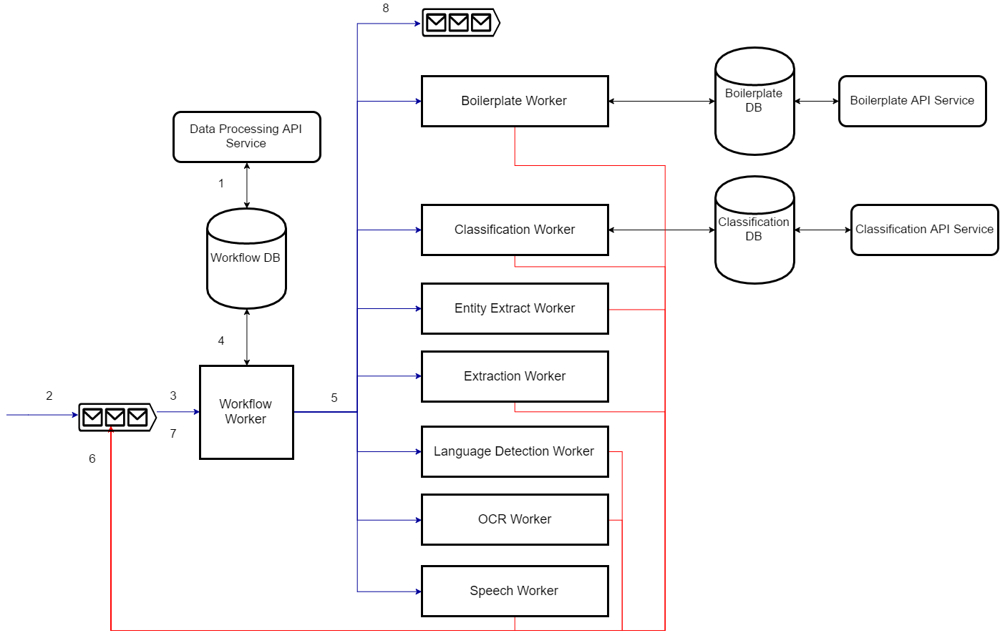
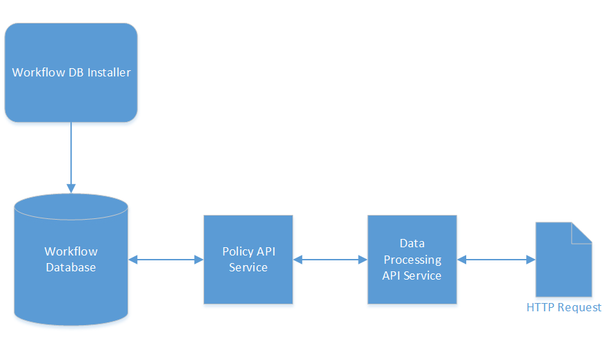

# Architecture

The Data Processing service is actually a suite of services that form a fully-featured processing solution. It consists of the following:

- Workers, built against the CAF Worker Framework, for processing input data.
- API's for customizing logic that can be applied during processing, for example, workflows and boilerplate expressions.

The sections that follow provide a high-level architectural overview of the various components that make up the Data Processing service and how they interact. Each component is available as a Docker container and the suite can be deployed using the compose file available [here](https://github.com/CAFDataProcessing/data-processing-service-deploy). Instructions on using the compose file can be found on the [Getting Started](./Getting-Started) page.

## Overview

The Data Processing service consists of web service API's, workers built against the Worker Framework and databases to store information. Workers and API's are state-less in this system and thus can scale using the auto-scaler to accommodate the workload at any point in time. Tasks are sent to workers through messages on RabbitMQ queues and the results come as messages to designated queues by each worker.

The figure below illustrates the overall flow and relationship of components in Data Processing.

1. The Data Processing API manages workflows in the database, describing actions that should occur on items passed with specific workflows.
2. Input messages are passed into the workflow worker input queue specifying a Workflow ID and details representing a document to process.
3. The workflow worker retrieves the next task from the input queue.
4. A workflow is retrieved from the workflow database using the ID specified on the task.
5. The data on the task is evaluated against the actions on the workflow. Each action is evaluated based on the rule and action order until the criteria for an action is met. A task is then created for the matching action type and sent to the appropriate worker for processing.
6. The processing worker processes the data and returns the result to the input queue of the workflow worker.
7. The workflow worker picks the input messages from the queue, identifies it as coming from a processing worker and includes information from the result on the data for the task.
8. Steps 5 through 7 continue until either all actions have been evaluated in the workflow or an action is triggered that outputs the data that has built up from processing actions to an external queue. The document can then be retrieved from this queue by another application awaiting the result of processing.

## Data Processing API

The Data Processing API is a web service that establishes processing workflows. Tasks passed to the workflow worker for processing indicate which workflow the task should use and the workflow in turn indicates the actions to perform on the data. This service relies on a policy workflow web service being accessible to it and the workflow database for that policy web service being installed.

The Data Processing API is a NodeJS web service that communicates with the policy API web service to manage back-end objects representing data processing concepts.
The Data Processing API simplifies the creation of workflows for processing by wrapping what would be multiple calls to the policy API into single concepts, for example, an action in data processing is represented by a collection and a policy in the policy database. This approach simplifies the inputs required on requests by defaulting options relevant to Data Processing.
You get the benefit of using the policy API, with its robust functionality, existing integrations and proven stability, and tailoring the interface point for a consumer to be easily understood and utilized in the context of data processing.

## Workflow Worker

This worker determines the next action for a task, sending the relevant data to the processing worker associated with the action, recording the processing result and then repeating the cycle. This worker relies on the workflow database.

The input task sent to this worker specifies a workflow created with the Data Processing API and a document, which may specify some existing metadata and a file location in CAF Storage. The worker retrieves that workflow from the shared database, then evaluates each action on the rules of the workflow. If the data passed on the task meets the criteria set for an action, then that Action is executed. Results from this action are added as fields to the document being processed and are available for subsequent processing actions.

*  Given a task where the only data originally passed is a storage reference to the file in CAF Storage, a text extract action  extracts the content and metadata of the file, recording them as fields on the current version of the task. From that point, any processing occurring may rely on that extracted metadata or content, for example, conditions based on expected field values, redaction of text from the content.

The worker applies the result returned to the data that was passed in, building up the data as it is evaluated against each action. At the end of a workflow, it either returns a list of all actions that were matched in a workflow or outputs the built-up data representing the processed document to a queue for usage by another application.

### Handlers and Converters

Handlers and converters are plugins that can be passed to a workflow worker during deployment. They describe how to send tasks and handle output to/from processing workers.

Handlers let you send a task to another type of worker from the workflow worker. They specify how to build up the task expected by the recipient worker:

* An action type uses its internal_name to indicate the plugin that should build the task. Its definition describes properties available to actions that can influence the properties that will be set on a task.
  * For example, the text extract action type definition specifies a property called depth, which may be set on created actions under settings. When set on an action, this value then sets the depth property on the task sent to the extraction worker.
* The handler also extracts relevant data from the current document that is required by the processing worker.
  * For example, when sending a message to the extraction worker, the handler sets the source data reference to the location of the file in CAF Storage so it may be retrieved for processing.

The workflow worker then takes the task built by the handler and sends it to the input queue of the appropriate processing worker.

Converters provide the ability to take result messages from processing workers and record the relevant result information as fields on the document moving through the workflow.

* For example, the result from extraction worker outputs to the input queue of the workflow worker. The workflow worker recognizes the message as coming from extraction worker, inspects the result message for values that can be added to the document metadata and then proceeds to the next action in the workflow.

The state of a task as it moves through a workflow is maintained on the message passed between queues so that any workflow worker picking the task from an input queue can resume processing at the correct position.

## Workflow Database

Information about workflows, rules, actions and action types is stored in the workflow database. The database is included in the databases service launched by the data-processing compose file. This service can also be used to install the database to an external PostgreSQL instance, as documented [here](https://github.com/CAFDataProcessing/data-processing-service/tree/develop/utils/data-processing-databases-container#install-workflow-database).

This database is used by the Data Processing API (via the policy API that it communicates with) and the workflow worker. The API allows creation of the objects and the workflow worker then accesses them when processing tasks.

## Processing Workers

Process workers are sent tasks by the workflow worker. They perform some processing against those tasks. Each processing worker is intended to have a particular processing purpose in line with the micro-service principle. They return their completed tasks to the workflow worker, which records information about the result on the item processed.

## Boilerplate Worker

Responsible for the detection and removal/redaction of text, this worker depends on an installed boilerplate database for retrieving user-created expressions. It provides the following modes of processing data.

### Recognition of Email Signatures

The worker can automatically analyse text and detect any email signatures present and return the text without those signatures.

### Email Content Segregation

The worker can detect individual messages in an email and extract defined ranges under the categories of primary, secondary and tertiary content.

### Custom Expressions

Using the boilerplate API, you can specify regular expressions to match text in processed data. These expressions can then be used in boilerplate type actions to detect occurrences in data and, optionally, remove or replace the matched values.

#### Boilerplate API

The boilerplate API is a web service to facilitate the management of boilerplate expressions.

You create expressions using this web service and then reference them in boilerplate actions by their ID. You can also create tags, which allow the grouping of multiple expressions, and specifiy a single tag ID on a boilerplate action instead of multiple expression IDs. This practice enables you to create new expressions without updating the action.

#### Boilerplate Database

The expressions and tags created through the boilerplate API are stored in a database. The boilerplate worker contacts this database to retrieve expressions and tags using the IDs passed to it on input tasks. The database is included in the databases service launched by the data-processing compose file. This service can also be used to install the database to an external PostgreSQL instance, as documented [here](https://github.com/CAFDataProcessing/data-processing-service/tree/develop/utils/data-processing-databases-container#install-boilerplate-database).

## Entity Extract Worker

The entity extract worker uses the IDOL Eduction library to identify entities (Social Security numbers, email addresses, and so on) and optionally obfuscates them within documents. The worker also supports user supplied entities that are passed to the worker on start up. Entity extract actions define the grammars and entities that data should be checked against, and whether to return the presence of the entities or to remove/replace their occurrences.

## Extraction Worker

The extraction worker uses the Keyview SDK to extract metadata, content and files contained within archives (recursively). It can assign unique identifiers to the items it processes and those sub-files it extracts. MD5 hashes can also be generated for each item.

A valid Keyview license is required to use the extraction worker.

## Language Detection

Langauge detection receives a message containing data for analysis. The result indicates the top three languages found in the data.

## OCR Worker

The OCR worker receives a message with a reference to an image file in CAF Storage and performs OCR using ImageServer, returning any text extracted. Also supports extracting text from multi-page files such as PDFs.

This worker requires a valid ImageServer license.

## Speech Worker

The speech worker receives a message with a reference to an audio file in CAF Storage and returns the content as text. Can return time stamps against words also through action configuration.

This worker requires a valid Speech Server license.
