# Classification

The classification action compares the metadata of a document against a set of defined classifications to determine which match the data.

## Contents

+ [Overview](#overview)
+ [Getting Started](#getting-started)
+ [Architecture](#architecture)
+ [API](API)

## Overview

Classification in Data Processing makes use of the following:

+ The classification API defines the classifications and the workflows that group classifications to which a document is compared.
+ The classification worker receives documents and IDs indicating the workflow to evaluate.
+ The classification database stores the created classifications and workflow components.

An action can be created in Data Processing that refers to a workflow in the classification database. All documents that execute the action will have matching classifications recorded as metadata fields.

## Getting Started

### Deployment

The components required for classification are included as part of the data processing service compose file available [here](https://github.com/CAFDataProcessing/data-processing-service-deploy). Refer to Data Processing Getting Started [here](../Getting-Started) for deploy instructions.

### Definitions

The classification API defines the following concepts:

+ Classifications
  + A classification is a set of conditions representing a concept. For example, a simple classification such as Patent Emails could consist of conditions where the subject field contains Patent and the document type is an email. Classifications can be used across multiple classification rules.
+ Classification rules
  + A classification rule defines a set of classifications to which to compare a document. Optionally, you can define additional criteria that must be met for an item to be classified as a match against any classification in the set.
+ Rule conditions
	+ A rule condition specifies some further criteria that a document must meet before any classifications on the rule can be considered matches. For example, the classification rule may include the Patent Emails classification but add an extra condition on this rule that the document must have attachments.
+ Rule classifications
  + A rule classification is a classification that is added to a classification rule. Any document evaluated against the rule will have all added classifications assessed against the document.
+ Terms & Term Lists
  + Terms specify phrases or patterns that should be matched and grouped under a term list. Term lists can be referred to in the conditions on classifications. For example, a term list may consist of common words found in marketing material that are used in a classification called Marketing Emails.
+ Workflows
  + A workflow contains a set of classification rules to evaluate against a document.

### Using the Classification API User Interface

A user interface is provided on the same host and port as the classification API web service. The Swagger user interface page is accessible from the following address:

```
<classification-web-service-url>/classification-ui
```

### Setting up a Classification Workflow

To use the classification action in data processing, you must define the workflow used on the action through the classification API. For the purposes of this example, we will use the classification API Swagger user interface. All methods are HTTP contactable and may be called through traditional HTTP methods outside of this user interface. Calling libraries for the API may be generated using the Swagger contract for classification.

This example describes creating classifications, then adding these to a classification workflow used as an action in data processing.

#### Create a Classification

First, we create a classification to use later as part of the workflow. This classification represents the criteria for a document to be considered a Meeting Notification. It has conditions to match documents that specify a format matching email type and that have a field named location. For example, the classification definition should look like the following:

```
{
    "name": "Meeting Notifications",
    "description": "Documents that match this classification are Meeting Notifications.",
    "additional": {
    	"type": "boolean",
    	"operator": "and",
	    "children": [
	      {
	        "name": "Location field",
	        "description": "The location field must exist.",
	        "additional": {
	          "type": "exists",
	          "field": "Location"
	        }
	      },
	      {
	        "name": "Is an Email",
	        "description": "The document type is email.",
	        "additional": {
	          "type": "number",
	          "field": "DOC_FORMAT_CODE",
	          "value": 345,
	          "operator": "eq"
	        }
	      }
	    ]
  }
}
```

1. Under Classifications, expand the POST operation /classifications.
2. Enter a value in the project_id field, for example, DefaultProjectId. This represents the user group that has access to the created objects and should be the same for all calls made for that user group. This should be the same project_id as used in creating Data Processing workflows as otherwise the classification workflow will not be visible to the action.
3. Copy the classification example from above. It consists of the name and description for the classification, a boolean condition that specifies two conditions that must match. The first condition states that a field named Location must exist and the second that the field DOC_FORMAT_CODE must be equal to 345.
5. Click Try it out. The resulting code shows whether the creation of the classification succeeds (201 for successful creation), along with an ID for the newly created classification.

    

Now we will create another classification to find travel documents that makes use of term lists.

#### Create a Term List

The term list holds the terms that describe a travel document. The ID of the term list is used in a condition on a classification to check if any of the specified terms are present in the document.

1. Under Terms, expand the POST operation /termlists/.
2. Set the project_id parameter.
3. Under Parameters, click on Model to see the properties that can be passed for a new term list.
4. Click on Example Value and then the box underneath to set the paramter newTermList to the example value.
5. Edit the name field to be Travel Document Wording.
6. Click Try it out. The resulting code shows whether the addition of the term list succeeds (201 for successful creation), along with an ID for the newly created term list.

    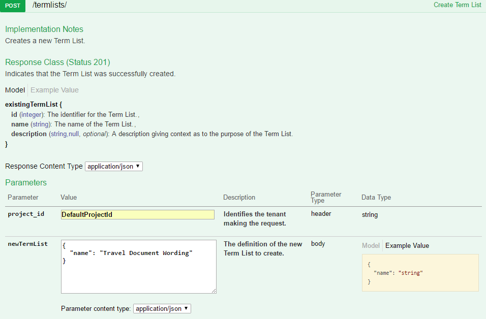

#### Add Terms

Now we can add terms to the term list to describe common phrases in travel documents. For example, you might use the phrase Flight Purchase Confirmation or Flight Itinerary. The definition of a term and the acceptable values for its properties can be seen in the API contract.

The terms we pass should be defined as follows:

```
{
    "terms": [
    	{
          "expression": "\"Flight Purchase Confirmation\"",
          "type": "text"
        },
        {
          "expression": "\"Flight Itinerary\"",
          "type": "text"
        }
     ],
    "overwrite":false
}
```

1. Under Terms, expand the PUT operation /termlists/{termListId}/terms.
2. Set the project_id and termListId parameters. termListId should be set to the ID of the term list created in the previous section.
3. Click on the box underneath Example Value to populate the terms parameter. Edit this value to the term definition above.
4. Click Try it out. The resulting code shows whether the addition of the terms succeeds (204 for successful addition of terms to the term list).

    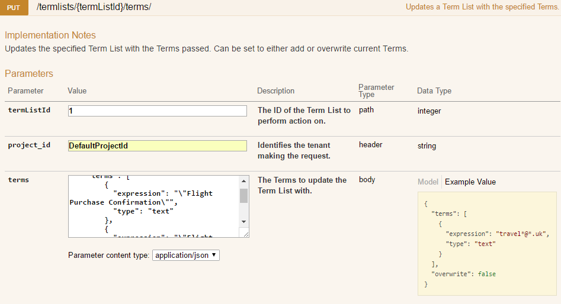

#### Create a Classification for Travel Documents

With the term list and terms, we can now use them in a classification as a condition. The classification definition looks like the following:

```
{
    "name": "Travel Documents",
    "description": "Classification to match travel documents.",
    "additional": {
    	"type": "termlist",
    	"field": "CONTENT",
    	"value": "1"
  }
}
```

1. Under Classifications, expand the POST operation /classifications.
2. Set the project_id.
3. Copy the classification definition from above. Update the value property on the termlist condition to the ID of the term list that you created previously.
4. Click Try it out. The resulting code shows whether the creation of the classification succeeds (201 for successful creation), along with an ID for the newly created classification.

    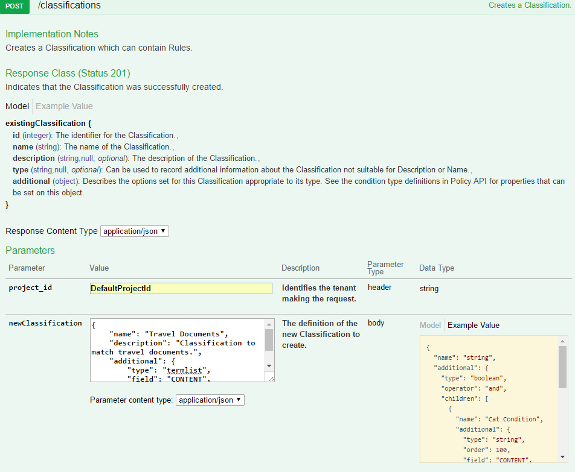

#### Create a Workflow
The created classifications can now be used in a workflow that contains classification rules. The ID of the workflow created is used in the classification action in Data Processing so that the classification worker knows the rules against which to evaluate the document.

1. Under Workflows, expand the POST operation /workflows.
2. Set the project_id.
3. Click on the example value box on the right to fill in the new workflow body.
4. Edit the name field to reflect the workflow purpose, for example, Default Classifications.
5. Click Try it out. The resulting code shows whether the creation of the workflow succeeds (201 for successful creation), along with an ID for the newly created workflow.

    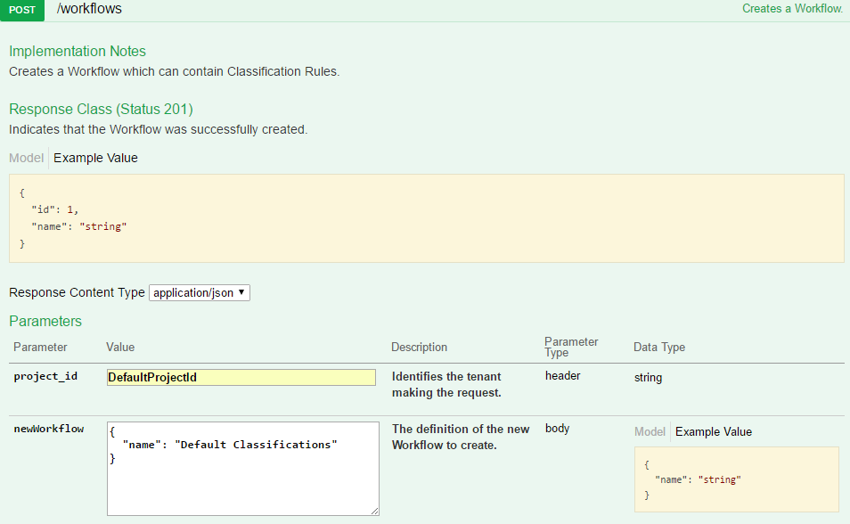

#### Create a Classification Rule
Underneath the workflow, we add a classification rule to specify all of the classifications against which to check the document for this workflow.

1. Under Processing Rules, expand the POST operation /workflows/{workflowId}/rules/.
2. Set the project_id and set the workflowId to the ID of the workflow that was created.
3. Under Parameters, click on Model to see the properties that can be passed for a new rule.
4. Click on the example value box on the right to fill in the new classification rule body.
5. Edit the name field to reflect the classification rule purpose, for example, Email and Travel Docs. Add a description property, if relevant.
6. Click Try it out. The resulting code shows whether the addition of the rule succeeds (201 for successful creation), along with an ID for the newly created workflow.

    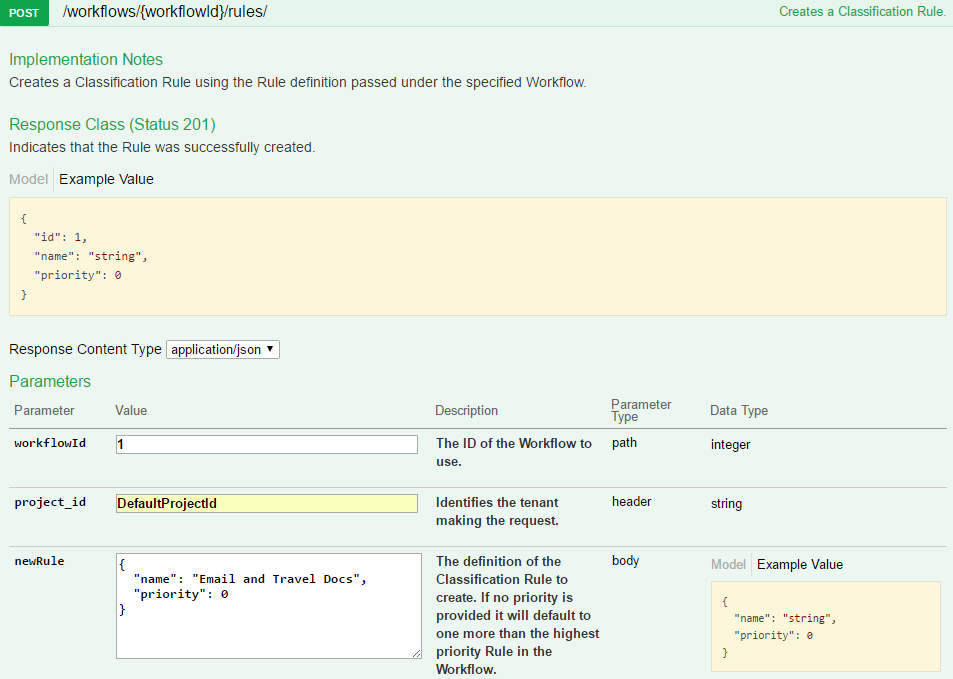

#### Create Rule Classifications
We now add the defined classifications as entries on this classification rule so that the document is checked for matches to either classification.

1. Under Rule Classifications, expand the POST operation /workflows/{workflowId}/rules/{classificationRuleId}/classifications.
2. Set the project_id, set the workflowId to the ID of the workflow that was created and set the classifificationRuleId to the classification rule that was created.
3. Click on the example value box on the right to fill in the new rule classification body.
4. Edit the classificationId property to match the ID of the Meeting Notifications classification.
5. Click Try it out. The resulting code shows whether the addition of the rule classification succeeds (201 for successful creation), along with an ID for the newly created rule classification entry.

    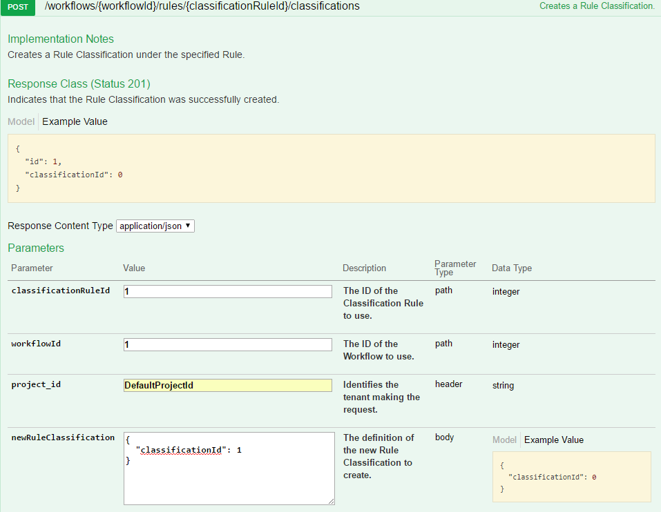
6. Edit the classificationId property to match the ID of the Travel Documents classification.
7. Click Try it out. The resulting code shows whether the addition of the rule classification succeeds (201 for successful creation), along with an ID for the newly created rule classification entry.

    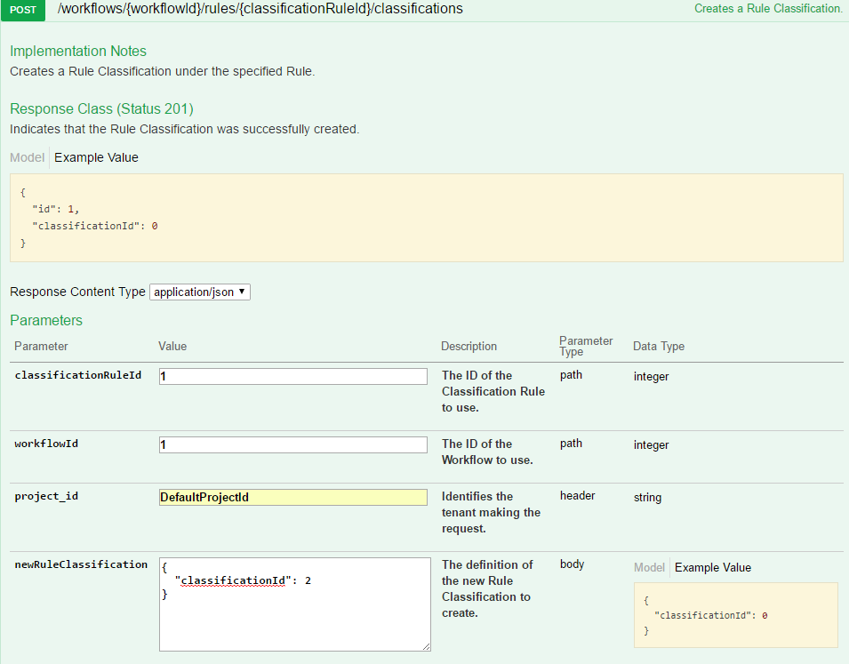

#### Create a Classification Action

We now need to specify the classification workflow to use in Data Processing through a classification action. For this purpose, we use the Data Processing API. For steps on setting up the workflow and rule around the action, see the Data Processing Getting Started guide [here](../Getting-Started).

1. Under Actions, expand the POST operation /workflows/{workflowId}/rules/{ruleId}/action.
2. Set project_id, workflowId and ruleId. 
3. Click on the example value box on the right to fill in the new action body.
4. Click on Model for an explanation of each property.
5. Delete the queueName property (allowing the default value for the deployed system).
6. Under settings, add a property workflowId with the value set to the ID of the workflow created using the classification API.
7. Set the name of the action to Classify Action and the typeId to the ID of the Classification action type. This will be the action type with internal name set to ExternalClassificationPolicyType).
8. Click Try it out. The call will return code 201 for successful creation along with the successfully created action and an ID.

    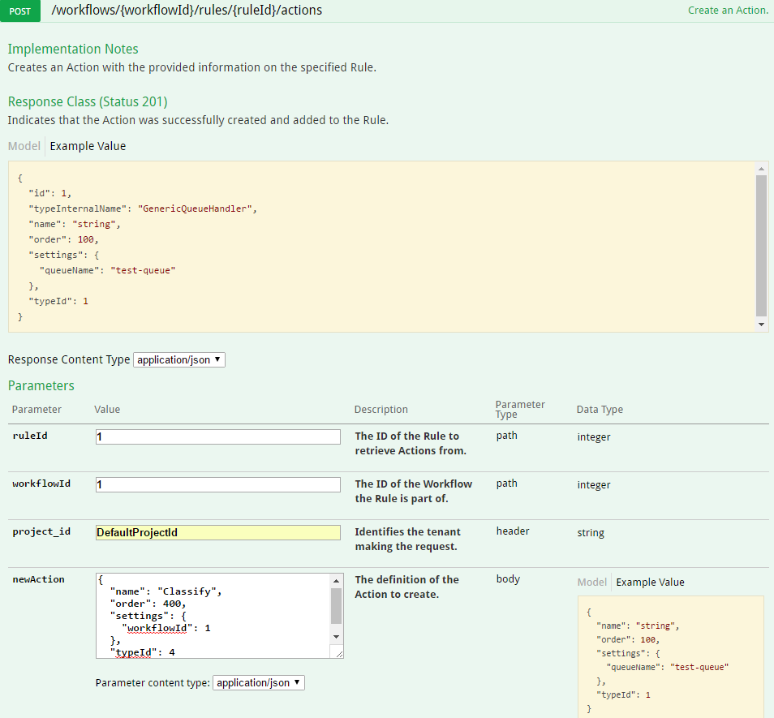

#### Summary

The classification action causes any document on which it is executed to be compared against the Meeting Notification and Travel Document classifications. If the document matches either classification, this will be recorded on the metadata of the document.

Through adding rule conditions to the classification rule further refinement across the selected classifications can be applied. Further classifications and classification rules can be added to create complex groups into which documents are categorized.

## Architecture

The figure below illustrates a high level view of the components making up Classification.

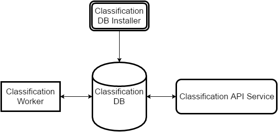

The database installer is used to create the classification database. The API service is then used to create and manage classifications and workflows in this database. The classification worker then retrieves these workflows from the database.

### Classification API

The classification API is a web service that manages classifications and workflows used by the classification worker. Tasks passed to the classification worker indicate a workflow the task should use and the workflow in turn defines the classification rules against which the data passed on the task should be compared. The service relies on a policy classification web service being accessible to it and the database for that policy web service being installed.

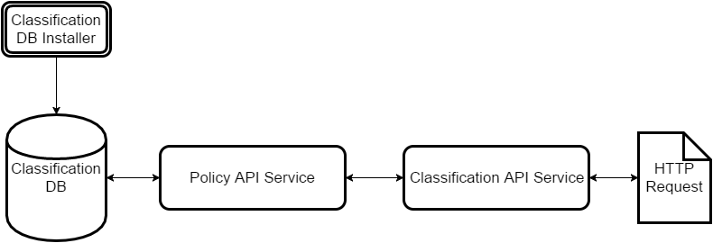

The API is a NodeJS web service that communicates with the policy API web service to manage back-end objects representing classification concepts. The classification API simplifies the creation of classifications and workflows in Data Processing in the same way as the Data Processing API.

* Multiple calls to policy APIs are grouped into a single path on the classification API.
* Defaulting of properties to appropriate values for classification requires the caller to specify a minimum required set.
* Easier to understand interface for classification through tailored concepts, such as classifications and classification rules.

The GitHub Repository for the Classification API is available [here](https://github.com/CAFDataProcessing/classification-service).

### Classification Worker

This worker reads tasks from its input queue, which contain the ID of a workflow in the classification database and data which the workflow should be evaluated against. The worker relies on an accessible database classification database accessible.

The worker retrieves the specified workflow from the database and evaluates the passed data, which represents a document as metadata fields.

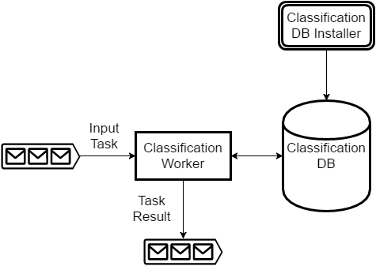

The data is compared against each classification rule in the workflow to see which classifications can be considered matches. Once all classification rules have been evaluated the resulting matches are then output as a result message to the output queue of the worker.

### Classification Action

Data Processing invokes the classification worker through the use of the classification action. The action should define the workflow to evaluate against in its settings.

#### Example Classification Action Settings Property

```
{
  "workflowId": 1
}
```

When the result from the classification worker is processed by the workflow worker, the classifications matched will be recorded as metadata fields on the built-up document. The id of matched classifications are stored in 'POLICY_MATCHED_POLICYID', with the classification names being stored in 'POLICY_MATCHED_POLICYNAME'.

#### Example Document Metadata

```
{
  "POLICY_MATCHED_POLICYID": ["1", "2"],
  "POLICY_MATCHED_POLICYNAME": ["Travel Documents", "Meeting Notifications"]
}
```

The Classification Worker is built as part of the worker-policy project [here](https://github.com/CAFDataProcessing/worker-policy).