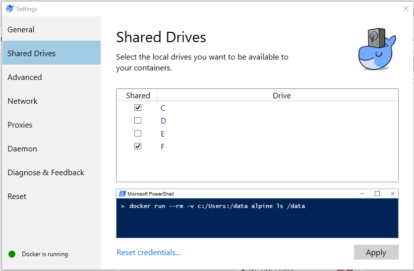
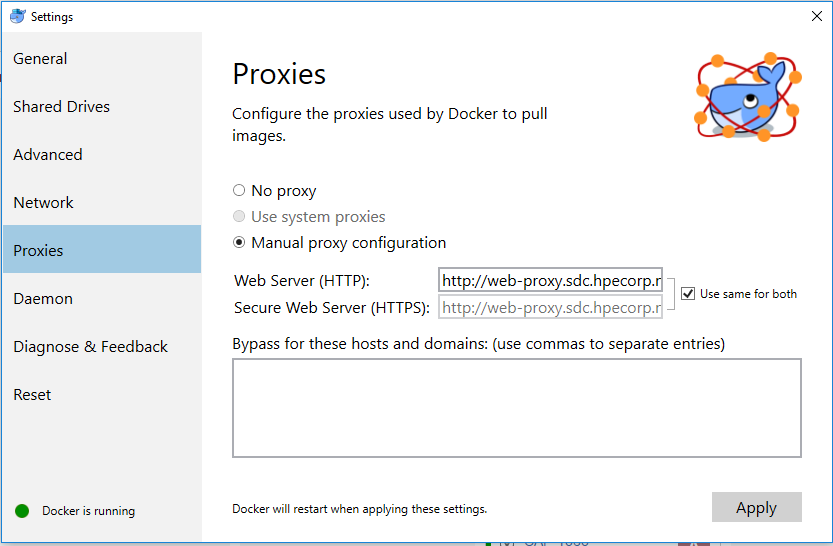

# Docker Setup

This page demonstrates configuring a Docker for Windows install to be able to launch the containers using the data-processing-service-deploy compose file.

## Shared Drive

Set the drives that you want to be available to the containers e.g. those containing license files.

## Proxies

Configure the proxies used to pull images to use the HPE proxies.

