# Getting Started

## Deploying Data Processing

The recommended method for deploying data processing components is through a [Docker Compose](https://docs.docker.com/compose/) file.

* A compose file for Enterprise Edition to deploy the full suite of data processing services is available [here](https://github.houston.softwaregrp.net/caf/data-processing-service-internal-deploy). This includes actions that require a license such as Metadata Extraction, Speech to Text, Entity Extraction and more. Details on obtaining a license for Enterprise Edition can be found on the [Overview](./Overview) page.

### Prerequisites

Running this compose file requires docker-compose to be installed at a minimum version of 1.10.0 and a docker engine at a minimum version of 1.13.0. You can run the "docker --version" command to verify docker is installed and at a supported version and run the "docker-compose --version" command to verify docker compose is installed and at a supported version. If either is not at the required version please refer to the Docker install instructions [here](https://www.docker.com/community-edition#/download) and the Docker Compose install instructions [here](https://docs.docker.com/compose/install/).

This guide describes using processing workers only available with the Enterprise Edition. For details on obtaining an Enterprise Edition license please raise an issue [here](https://github.com/CAFDataProcessing/data-processing-service/issues):

#### Licenses

1. Ensure you have valid licenses for the following components:
  *   Speech To Text
  *   OCR
  *   Keyview
  *   Entity Extract
2. The expected license filenames are a single license file 'licensekey.dat' for Speech To Text, OCR and Entity Extract and a license file 'kv.lic' for Keyview.
3. Copy each of these license files into the directory used for licenses by the compose file. This defaults to a folder 'licenses' in the same directory as the compose file. Another folder may be used by setting the `LICENSES_LOCAL_FOLDER` environment variable to the folder containing the licenses.

For license enquiries please raise an issue on the data-processing-service repository, [here](https://github.com/CAFDataProcessing/data-processing-service/issues).

### Images

Each service in the compose file uses a Docker image. Any images required that are not already on your machine will need to be pulled from docker registries. Your Docker installation should be configured to be able to pull images (example instructions are available [here](./Docker-Setup)). Images are pulled automatically as part of the docker-compose up command however it is suggested that the pull command be used to verify that all images can be successfully pulled.

```
docker-compose pull
```

### Run Services

From the command line, navigate to the directory the compose repository was downloaded to. To deploy the data processing services use the docker-compose up command.

```
docker-compose up -d
```

On startup the workflow database and a default workflow are installed to the database container deployed by the compose file. This can take around 5 minutes and messages will not be submitted until after this initialization. The progress of the initialization can be determined by checking the logs of the task-submitter container as it will report when messages begin to be submitted.

```
docker logs a0b
```

* Replace 'a0b' with the container ID of the running data-processing-task-submitter image.

To stop the containers run the following command;

```
docker-compose down -v
```

This will stop the services defined in the compose file and remove the volumes created for them e.g. the storage location used for the database. If you wish to persist information in the database for the next compose run, omit the '-v' flag from the down command and the volumes will not be removed.

### Debug Deployment

A compose file that adds additional debugging capability to the data processing services is included in the compose file repository. This exposes ports on the deployed services and increases log levels. It should be used by passing the debug file as an override file, as shown below;

```
docker-compose -f docker-compose.yml -f docker-compose-debug.yml up -d
```

### Submitting Files

The compose file will by default look in a directory './input', relative to the compose file directory, for files that should be submitted to data processing. The input location can be controlled via the `INPUT_DOCUMENTS_LOCAL_FOLDER` environment variable. The results of data processing will by default be indexed into an Elasticsearch instance stood up by the compose file. If a failure occurs during the generation of the workflow script by the workflow worker, the failure will be output to a folder './output' relative to the compose file directory. Any files present in the input directory on launch of the services will be submitted and any files added to the folder later will also be submitted.

### Default Workflow

The default workflow created by the task-submitter service in the compose file performs the following actions;
- generate SHA-1 digest of input file using the Binary Worker
- extract metadata and content of the file using the Extract Worker.
- if the file is an image then extract text from the image using the OCR Worker.
- if the file is an audio file then convert the audio to a text representation using the Speech Worker.
- extract hashes and other data based on metadata of the file using the Family Hashing Worker with differing behaviour for emails and non-emails.
- extract metadata and content of any child documents inside the file using the Extract Worker
- detect the languages used in the file using the Language Detect Worker.
- scan the file content for personally identifiable information using the Entity Extract Worker.
- scan the file content for matches to a selection of expressions using the Boilerplate Worker.
- index the processed file metadata

On launch the task-submitter will create this default workflow and begin submitting task messages using the ID of the created workflow. If the workflow that should be used already exists then the environment variable `CAF_TASKSUBMITTER_WORKFLOW_ID` should be set on the taskSubmitter service and that workflow ID will be used on messages instead.

#### Overriding Default Base Data Input Files

The input files used by the task-submitter to define the processing workflow and boilerplate expressions for use on submitted messages can be seen in the internal deploy repository [here](https://github.houston.softwaregrp.net/caf/data-processing-service-internal-deploy/tree/deploy/end-to-end-workflow). These files can be modified and passed to the task-submitter service through the base data input environment variables;

* `CAF_TASKSUBMITTER_BASEDATA_BOILERPLATE_INPUT_FILE`
* `CAF_TASKSUBMITTER_BASEDATA_WORKFLOW_INPUT_FILE`

Add the appropriate environment variable to the taskSubmitter service in the compose file with its value pointing to the location of the JSON file to read the base data definition from. The input file should be located in a volume that the container will be able to access.

#### Updating Default Workflow through Processing API

A new action may be added to the default workflow that was created by using the data processing web service. This example will demonstrate updating the workflow using the swagger UI included in the web service. 

A user interface is provided on the same host and port as the Data Processing API web service. The Swagger user interface page is accessible from the following address:

```
<data-processing-web-service-url>/data-processing-ui
```

Using the compose file this should be the address of your Docker machine and the port 9553 by default. Navigate to this location in a browser and you should see the Swagger UI for the service.

e.g localhost:9553/data-processing-ui

##### Get the Default Workflow ID

A new action must be added to a processing rule on a workflow. The workflow created by the task-submitter will have a specific ID that should be used to add the action under it. Use the 'Get Workflows' call to retrieve the workflows currently in the system.

1. Under Workflows, expand the GET operation /workflows.
2. Enter a value in the project_id field, the default value used by the compose file is 'Default'.
3. Click Try it out. The result output should contain the ID of the default workflow.

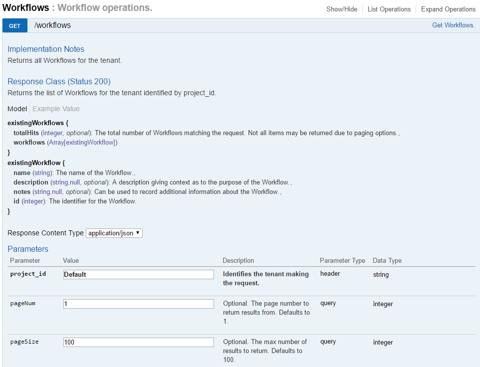

##### Get the Metadata Processing Rule ID

In the default workflow, the main processing actions that build up metadata about a file are grouped under a rule named 'Metadata Processing'. A new action can either be added to an existing processing rule such as this or a new processing rule. Here we will add the action to the 'Metadata Processing' rule. First retrieve the ID of that rule by using the 'Get Processing Rules' call on the default workflow.

1. Under Processing Rules, expand the GET operation /workflows/{workflowId}/rules/.
2. Enter a value in the project_id field, the default value used by the compose file is 'Default'.
3. Enter the ID of the default workflow in the workflowId field.
4. Click Try it out. The result output should return the rules currently under the workflow. One of them should be 'Metadata Processing', make note of its ID.

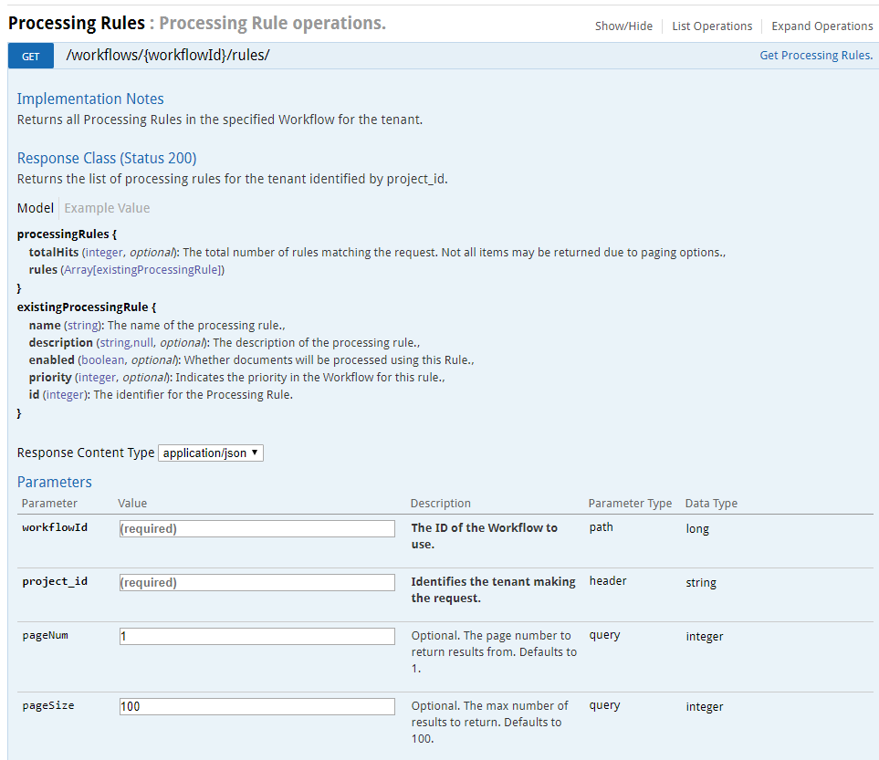

##### Get the Action Type ID

When we add the action to the processing rule we will need to specify an action type ID that indicates how to execute the action. For this example the action type we will use is the `ChainedActionType` type which will be included by default with the compose file services. Use the 'Get Action Types' call to retrieve the current action types in the system.

1. Under Action Types, expand the GET operation /actionTypes/.
2. Enter a value in the project_id field, the default value used by the compose file is 'Default'.
3. Click Try it out. The result output should return the action types. Search the results for the action type with 'internal_name' set to 'ChainedActionType' and note the ID.

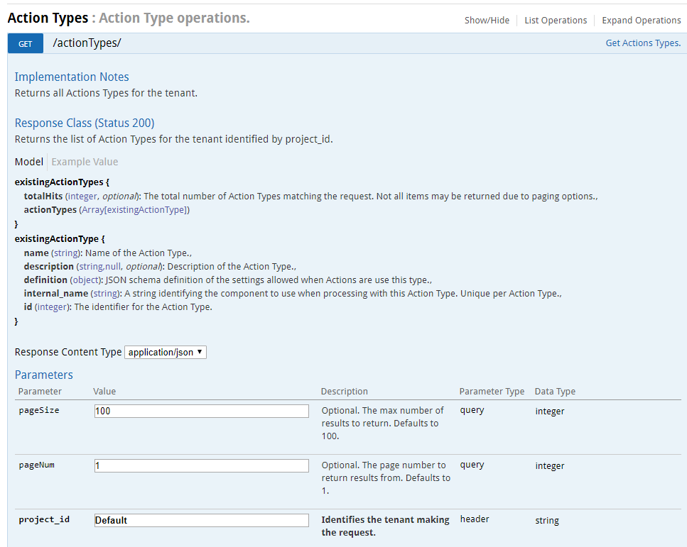

##### Creating the Action

The action that we will create will send a message to a Document Worker implementation that is monitoring a queue. We will send all the current metadata about the document and an additional parameter specific to the Document Worker implementation.

The definition of the action we will send is shown below;

```
{
  "name": "My Custom Action",
  "description": "",
  "order": 1100,
  "settings": {
    "workerName": "custom-worker",
    "queueName": "custom-input",
    "customData": {
      "workerOperation":"test"
    }
  },
  "typeId": 4
}
```

* The typeId is set to the `ChainedActionType` action type ID.
* The order field is set to 1100, a higher value than the existing actions on the rule, so that the action will occur after all currently defined actions on the processing rule.
* The settings property contains the action type specific properties, here being the name of the worker to use, the queue that worker is listening to and a custom property that the worker is expected to understand.

1. Under Actions, expand the POST operation /workflows/{workflowId}/rules/{ruleId}/action.
2. Enter a value in the project_id field, the default value used by the compose file is 'Default'.
2. Set workflowId and ruleId to the IDs retrieved from the previous calls.
3. Set the newAction property to te definition of the action to create.
4. Click Try it out. The result should return the details of the created Action.

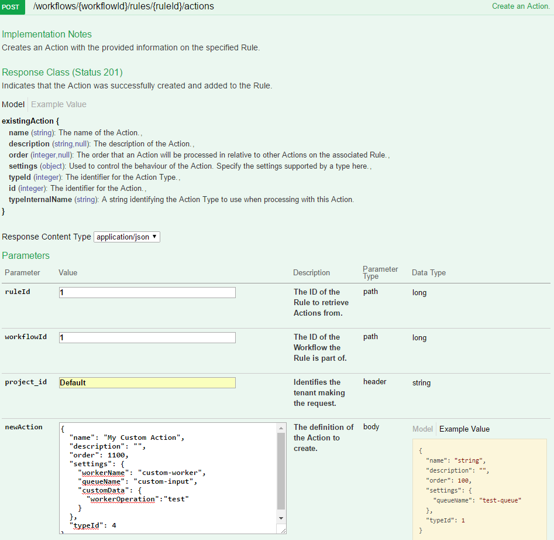

At this point the action has been added to the processing rule on the default workflow. When evaluating the workflow this action will by default be executed for all documents, sending them to the specified worker queue for processing by that worker.

##### Submit Documents

Documents submitted to the workflow worker will use the updated workflow once the previously cached version of the workflow script expires. By default this should be five minutes. For a shorter cache duration the debug compose file can be used as an override, which sets a cache duration of fifteen seconds. Submit files to the worker by adding them to the input folder being monitored by the taskSubmitter service.

### Manually Setting up a Processing Workflow

To process data it is necessary to set up rules for operations (actions) to perform on the data. As part of the compose file a default workflow is created by the task-submitter service that runs through a series of processing operations. This section will demonstrate how to create your own workflow using the processing API. For the purposes of this example, we will use the Data Processing API Swagger user interface. All methods are HTTP contactable and may be called through traditional HTTP methods outside of this UI. By default the compose file will make the processing API accessible on port 9553 of your docker machine.

#### Using the Data Processing API User Interface

A user interface is provided on the same host and port as the Data Processing API web service. The Swagger user interface page is accessible from the following address:

```
<data-processing-web-service-url>/data-processing-ui
```

#### Steps

##### Create a Workflow
This workflow holds the rules for handling items and is the ID passed on the task sent to the workflow worker with each item for processing.

1. Under Workflows, expand the POST operation /workflows.
2. Enter a value in the project_id field, for example, DefaultProjectId. This serves to represent the user group that will have access to the created objects and should be the same for all calls made for that user group.
3. Click on the example value box on the right to fill in the new workflow body.
4. Edit the name field to reflect your workflow purpose, for example, Extract Text & Output. Add a description property with further detail.
5. Click Try it out. The resulting code shows whether the creation of the workflow succeeds (201 for successful creation), along with an ID for the newly created workflow.

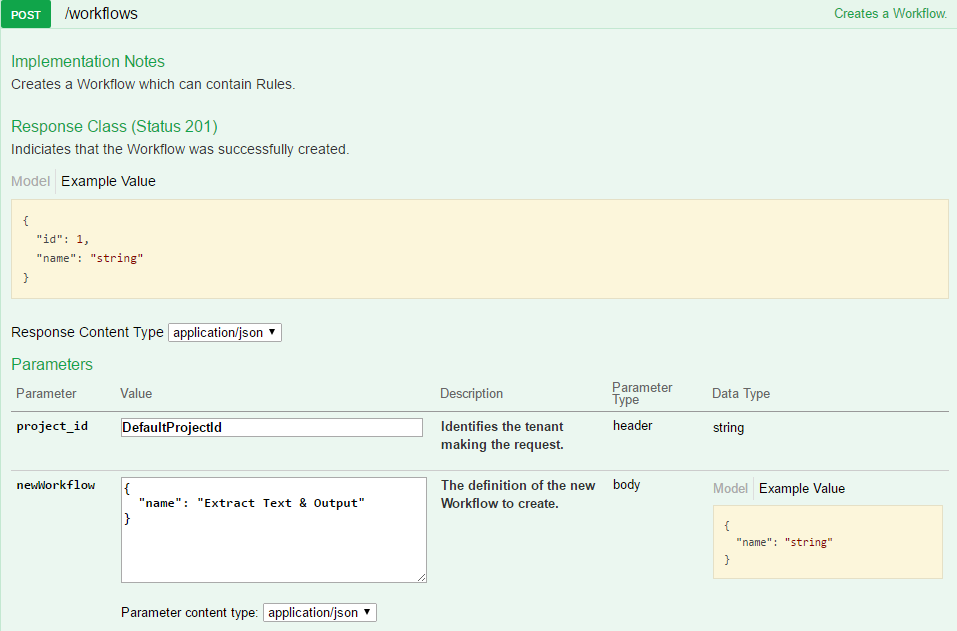

##### Create a Rule
Underneath the workflow, we add a rule that lists all of the actions that should be performed against the data assuming certain criteria is met.

1. Under Processing Rules, expand the POST operation /workflows/{workflowId}/rules/.
2. Set the project_id to the value used previously and workflowId to the ID of the workflow that was created.
3. Under Parameters, click on Model to see the properties that can be passed for a new rule.
4. Click on the example value box on the right to fill in the new rule body.
5. Edit the name field to reflect your rule purpose, for example, Extract. Add a description property.
6. Click Try it out. The resulting code shows whether the addition of the rule succeeds (201 for successful creation), along with an ID for the newly created rule.

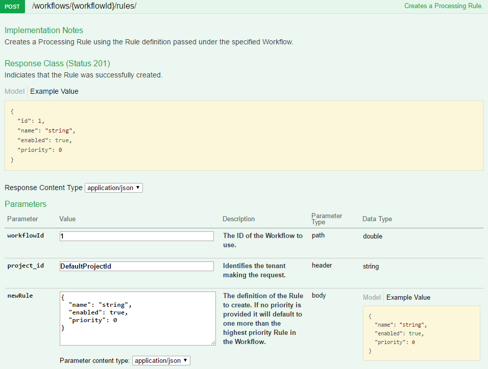

##### Retrieve Action Types
Before we can add actions to the rule we need to know the IDs of the various action types in the database. Retrieve the action types currently stored. A workflow worker deployed through the compose file will have registered the action types used in these examples.

1. Under Action Types, expand the GET operation /actiontypes/.
2. Set the project_id. The default paging parameters will suffice.
3. Click Try it out. The call will return code 200 for successful retrieval with a list of action types in the system, each describing their purpose and having an ID field. Note the ID values for Generic Queue, OCR and Text Extract.

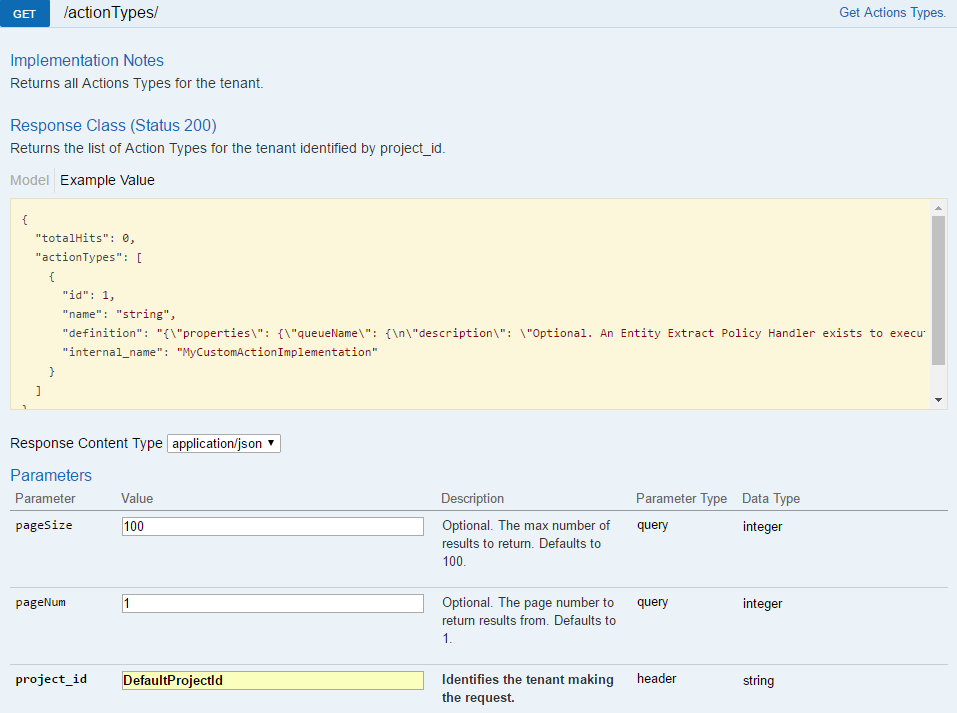

##### Create Extract Action
The first action we add to the rule will extract metadata from an item and the text content if it is a text-based document.

1. Under Actions, expand the POST operation /workflows/{workflowId}/rules/{ruleId}/action.
2. Set project_id, workflowId and ruleId to the values from previous calls. 
3. Click on the example value box on the right to fill in the new action body.
4. Click on Model for an explanation of each property.
5. On a system deployed using the compose file, it is not necessary to specify the queueName under settings for action. You can delete it because the environment configuration defaults the sending of messages to the appropriate queue for the action type. For this example, we will use all of the default settings for the action so the settings property may be removed.
6. Set the name of the action to Extract Action and the typeId to the ID of the chained action type. Add a description property.
7. Click Try it out. The call will return code 201 for successful creation along with the successfully created action and an ID.

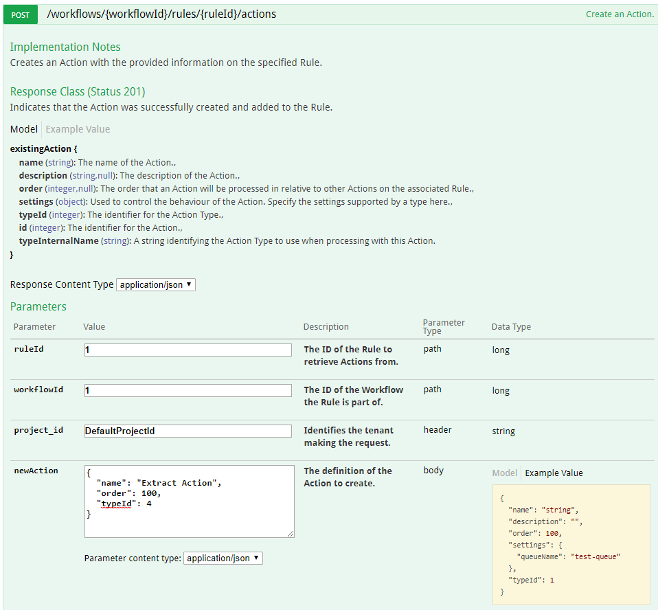

##### Create OCR Action
An action to perform OCR against image files will extract text from images onto the output result.

1. Repeat steps 1 to 5 from [Create Extract Action](#create-extract-action).
2. Set the name of the action to OCR Action and the typeId to the ID of the chained action type. Add a description property.
3. We want this action to occur after the Extract Action has completed in order that we may use the metadata from that action. Set the order property to 200.
4. Click Try it out. The call will return (code 201 for successful creation) with the successfully created action and an ID.

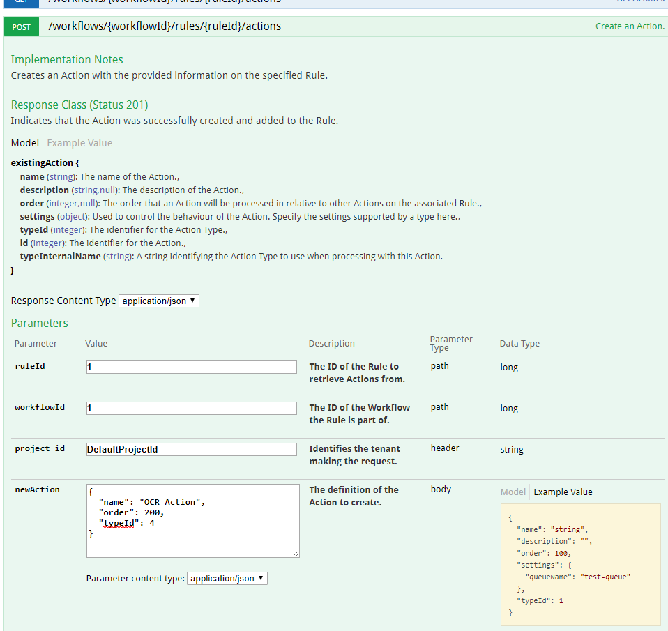

##### Add a Condition to the OCR Action
To avoid OCR being unnecessarily performed on non-image based items like .txt files or audio files, we will add a condition specifying the file classes that the OCR action should execute against. The list of document classes as allocated by the extract operation is detailed [here](./Text_Extract/copied/Document_Class_and_Format_Code). The OCR condition will be defined as below;

```
{
	"name": "OCR Condition",
	"additional": {
		"type": "boolean",
		"operator": "or",
		"children": [
			{
				"name": "Raster Image Condition",
				"additional": {
					"type": "string",
					"order": 100,
					"field": "DOC_CLASS_CODE",          
					"operator": "is",
					"value": "4"
				}
			},
			{
				"name": "Vector Image Condition",
				"additional": {
					"type": "string",
					"order": 200,
					"field": "DOC_CLASS_CODE",          
					"operator": "is",
					"value": 5
				}
			}
		]
	}
}
```

1. Under Action Conditions expand the POST operation /workflows/{workflowId}/rules/{ruleId}/actions/{actionId}/conditions.
2. Set project_id, workflowId, ruleId and actionId to the values from previous calls.
3. Details of possible values for the condition can be found in the [API](Data_Processing/API) contract. Set the new condition body to the OCR condition described.	
4. This condition only executes the action when the item processed has a field called DOC_CLASS_CODE, which has a value of either 4 (raster image) or 5 (vector image). The Extract Action will have added this field based on the file it was passed.
5. Click Try it out. The call will return code 201 for successful creation along with the successfully created action condition and an ID.

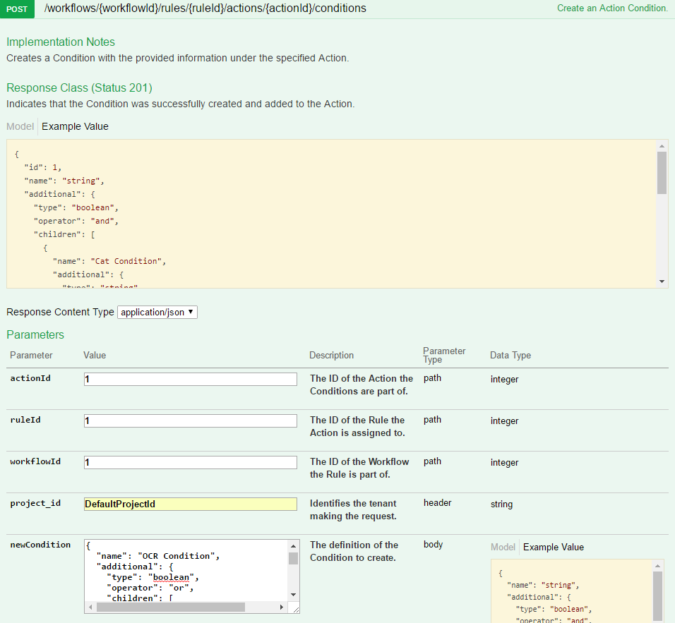

##### Create Language Detection Action
With text content extracted for both text and image files, you can perform language detection to pick out the most prevalent languages in that content. As with extract, no condition is set on this action, which causes it to always execute against an item as long as it is not prohibited by any rule condition.

1. Repeat steps 1 to 5 from [Create Extract Action](#create-extract-action).
2. Set the name of the action to Language Detection Action and the typeId to the ID of the chained action type. Add a description property.
3. We want this action to occur after the extract and OCR actions in order that we can use the text content extracted by both. Set the order property to 300 for this purpose.
4. Click Try it out. The call will return code 201 for successful creation along with the successfully created action and an ID.

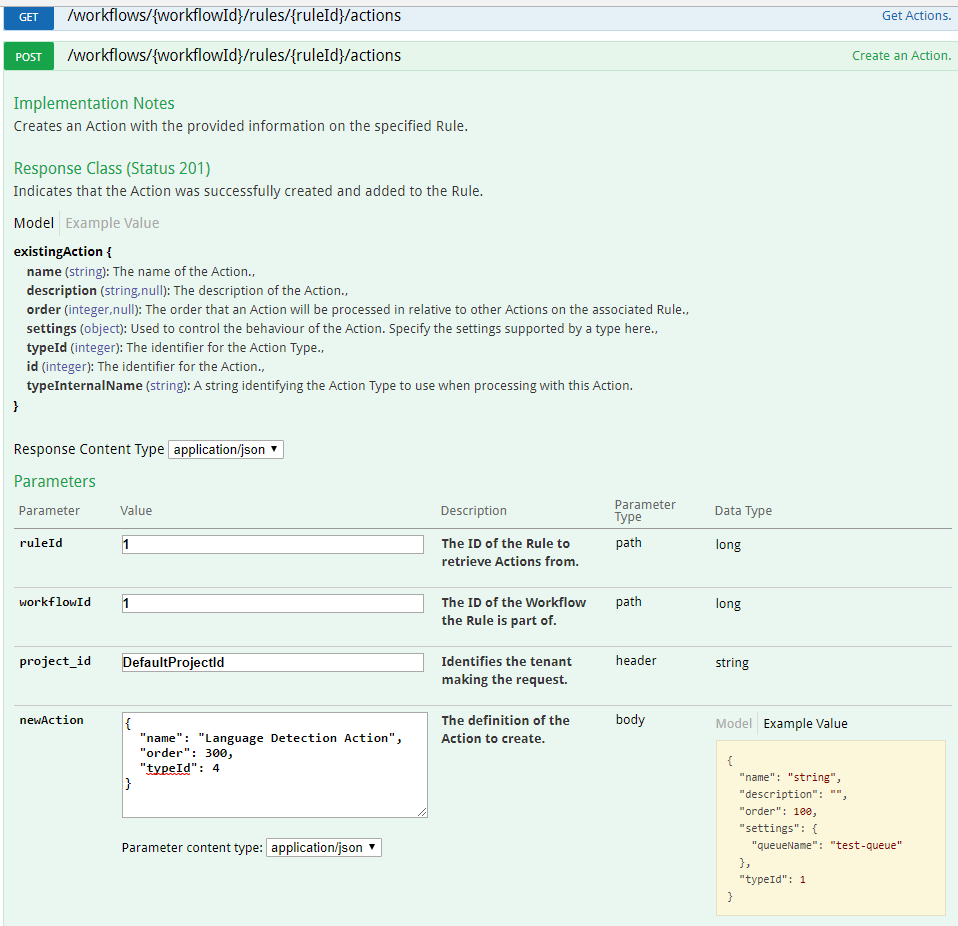

##### Create a Second Rule to handle Output
All actions to this point were added to a single rule. We will add a second rule that is tasked with outputting the built up result of the extraction to a queue. This separation, while not required, is useful if you want to add rule conditions on a set of processing actions but still need to output all items.

1. Under Processing Rules expand the POST operation /workflows/{workflowId}/rules/.
2. Set the project_id to the value used previously and workflowId to the ID of the workflow that was created.
3. Under Parameters, click on Model to see the properties that can be passed for a new rule.
4. Click on the example value box on the right to fill in the new rule body.
5. Edit the name field to reflect the rule purpose, for example, Output. Add a description property.
6. This rule needs to be evaluated after the extraction in order that the result will be output. Set the priority to a value higher than that of the first rule, for example, 10.
7. Click Try it out. The resulting code shows whether the addition of the rule succeeds or not (201 for successful creation), along with an ID for the newly created workflow.

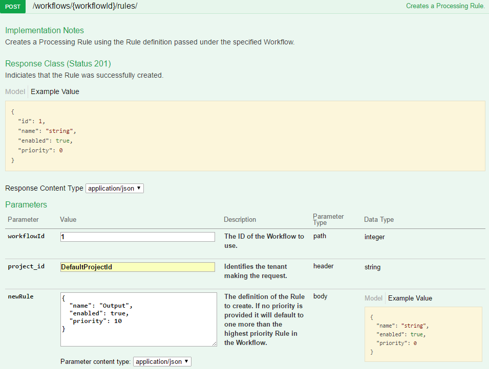

##### Create an Action to Index the Output Result
To output the built up result from the processing actions, create an action to send the processed task to the indexing worker, which can send the file with all of its added fields to any specified queue.
1. Under Actions, expand the POST operation /workflows/{workflowId}/rules/{ruleId}/action.
2. Set project_id, workflowId to the values from previous calls. Set ruleId to the ID of the second rule created.
3. Click on the example value box on the right to fill in the new action body.
4. Set the name of the action to output action and the typeId to the ID of the chained action type. Change the queueName settings value to the queue the index worker listens on i.e. 'worker-indexelastic-in'.
5. Click Try it out. The call will return code 201 for successful creation with the successfully created action and an ID.

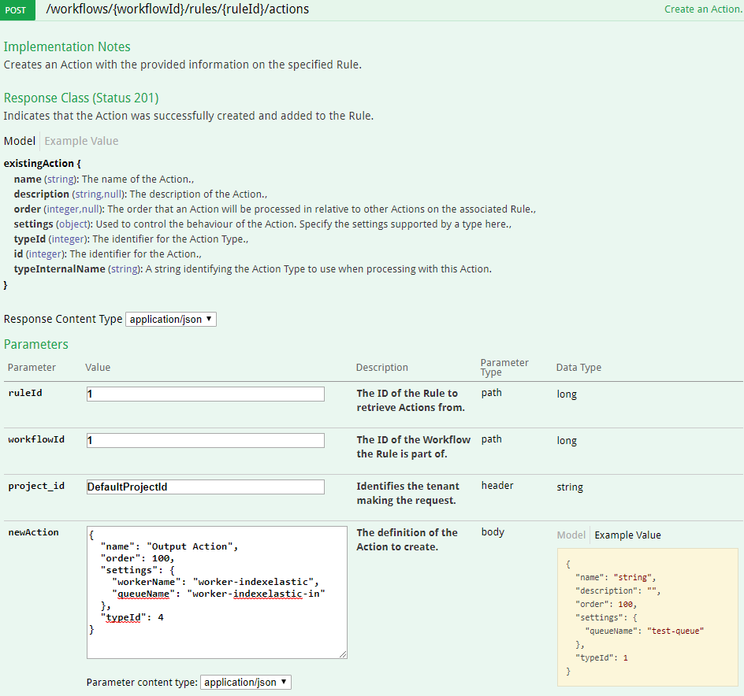

##### Using the Created Workflow

To process documents against the workflow that has been created you can update the services to use the workflow. In the data-processing-service compose file under the task-submitter service, add an environment variable CAF_TASKSUBMITTER_WORKFLOW_ID set to the ID of the created workflow. Run the 'docker-compose up -d' command and the task-submitter service should be updated. Now when the task-submitter starts it will not create the default workflow and instead will use the ID of the workflow provided on messages sent to the workflow worker.

#### Summary

When passed as the WorkflowId on a task to the workflow worker, this workflow specifies that:

* An item should have its metadata extracted (including text for text-based files).
* If it is an image, then the item will have OCR performed to extract its text.
* Then the text will have its language detected.
* The result describing the processed item should then be indexed into Elasticsearch so that the result may be examined.

#### Message Format

The format of the input task data is described in detail in the GitHub Repository for the Document Worker Framework [here](https://github.com/CAFDataProcessing/worker-document/tree/v4.0.0/worker-document-shared#composite-document-handling) under 'Composite Document Handling'. The workflow worker specific properties are described [here](https://github.com/CAFDataProcessing/worker-workflow/tree/develop/worker-workflow-container#input-task-custom-data). In the context of data processing the key properties to highlight are;

* workflowId, which should be set to the ID of the workflow that document should be processed against.
* projectId, which should be set to the ID of the tenant that was used in creating the workflow.
* outputPartialReference, should point to the data store folder to use during processing.
* document, this is a document object that the workflow worker can interact with. The metadata properties on this will be populated by the workflow worker as the task moves through processing and new data is extracted. A field 'storageReference' on metadata should be passed that contains the reference to the document in CAF storage for the workers to access.

This should then be base64 encoded and set as the task data of a caf worker task message. The taskClassifier property should be set to `DocumentWorkerTask`. An example task message is shown below;

```
{
	"version": 3,
	"taskId": "0-Bad team.docx",
	"taskClassifier": "DocumentWorkerTask",
	"taskApiVersion": 1,
	"taskData": "ew0KCSJkb2N1bWVudCI6IHsNCgkJInJlZmVyZW5jZSI6ICIvaW5wdXRGb2xkZXIvRW50aXR5X0V4dHJhY3Rpb24ucGRmIiwNCgkJImZpZWxkcyI6IHsNCgkJCSJGSUxFTkFNRSI6IFt7DQoJCQkJImRhdGEiOiAiRW50aXR5X0V4dHJhY3Rpb24ucGRmIiwNCgkJCQkiZW5jb2RpbmciOiAidXRmOCINCgkJCX1dLA0KCQkJIkFSQ0hJVkVfSUQiOiBbew0KCQkJCSJkYXRhIjogImIzMmNhNjFhLWU5OTYtNDcxNy1hYzdlLTlkZjk0MTVhMzllYiIsDQoJCQkJImVuY29kaW5nIjogInV0ZjgiDQoJCQl9XQ0KCQl9LA0KCQkic3ViZG9jdW1lbnRzIjogW10NCgl9LA0KCSJjdXN0b21EYXRhIjogew0KCQkib3V0cHV0UGFydGlhbFJlZmVyZW5jZSI6ICIvZGF0YVN0b3JlIiwNCgkJInByb2plY3RJZCI6ICJEZWZhdWx0UHJvamVjdElkIiwNCgkJIndvcmtmbG93SWQiOiAiMSINCgl9DQp9",
	"taskStatus": "NEW_TASK",
	"context": {		
	},
	"to": null,
	"tracking": null,
	"sourceInfo": null
}
```

And an example of the decoded task data that the workflow worker will execute against below (note these task messages are intended as for illustration purposes, the exact format required should be verified against the version of the workflow worker deployed in your environment);

```
{
	"document": {
		"reference": "/inputFolder/Entity_Extraction.pdf",
		"fields": {
			"FILENAME": [{
				"data": "Entity_Extraction.pdf",
				"encoding": "utf8"
			}],
			"ARCHIVE_ID": [{
				"data": "b32ca61a-e996-4717-ac7e-9df9415a39eb",
				"encoding": "utf8"
			}]
		},
		"subdocuments": []
	},
	"customData": {
		"outputPartialReference": "/dataStore",
		"projectId": "DefaultProjectId",
		"workflowId": "1"
	}
}
```

#### Publishing Messages

Messages may be sent to the workflow worker to be processed against a workflow by modifying the task-submitter service in the data-processing-service-deploy file to use a provided workflow ID by passing the environment variable CAF_TASKSUBMITTER_WORKFLOW_ID in the service definition.

Some other examples of how to submit messages to the workflow worker are;

* Through the Job Service using a plugin for workflow worker messages
* Submitting directly to the input queue through the Rabbit Management browser UI pointing to the Rabbit deployment used by the worker
* Submitted directly to the input queue via Rabbit Messaging library in code. 
