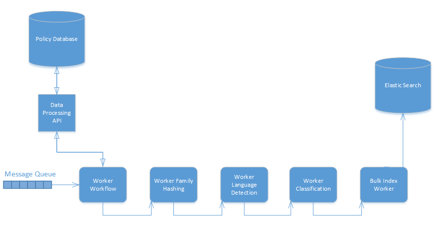
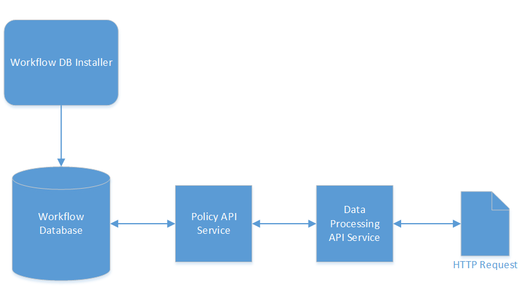

# Architecture

The Data Processing service is actually a suite of services that form a fully-featured processing solution. It consists of the following:

- Workers, built against the CAF Worker Framework, for processing input data.
- APIs for customizing logic that can be applied during processing, for example, workflows and boilerplate expressions.

The sections that follow provide a high-level architectural overview of the various components that make up the Data Processing service and how they interact. Each component is available as a Docker container and the suite can be deployed using the compose file available [here](https://github.houston.softwaregrp.net/caf/data-processing-service-internal-deploy/tree/deploy). Instructions on using the compose file can be found on the [Getting Started](./Getting-Started) page.

## Overview

The Data Processing service consists of web service APIs, workers built against the Worker Framework and databases to store information. Workers and APIs are state-less in this system and thus can scale using the auto-scaler to accommodate the workload at any point in time. Tasks are sent to workers through messages on RabbitMQ queues and the results come as messages to designated queues by each worker.

The figure below illustrates the overall flow and relationship of components in Data Processing. For the sake of reducing the size of the diagram only some of the processing workers are represented but all the processing workers should behave in the same fashion. 

1. The Data Processing API manages workflows in the database, describing actions that should occur on items passed with specific workflows.
2. Before sending any tasks to the workflow worker, a workflow with rules and actions should be created using the Data Processing API.
3. Input messages are passed into the workflow worker input queue specifying a workflow ID and details representing a document to process.
4. The workflow worker retrieves the next task from the input queue.
5. A workflow is retrieved from the workflow database using the ID specified on the task.
6. The workflow is converted to a JavaScript script that the document can be evaluated against by a Document Worker to determine the workflow action that should be executed for the document.
7. The data on the task is evaluated against the workflow script. Each action is evaluated based on the rule and action order until the criteria for an action is met. A task is then created for the matching action type and sent to the appropriate processing worker for processing based on the settings of the action. The generated workflow script is passed on this output task so that the next worker may repeat the evaluation when it has finished processing.
8. Each processing worker processes the data it reads from the input queue, adding/updating/removing any applicable fields. For example the extraction worker will retrieve the task from the queue, retrieve the file using the storage reference on a field of the document and extract metadata for that file, adding this metadata as fields on the document.
9. After processing the document, it is evaluated against the workflow script passed to determine the next action to execute. If the action requires going to another worker the processing worker sends the task to another queue. Steps 8 & 9 repeat until all actions have been evaluated in the workflow. e.g. In the diagram, extraction worker determines the language detection action should be executed for the document so the message is sent to the language detection worker, which performs language detection and then determines where next to send the worker.
10. The document should be retrieved from the last queue that it is sent to once all actions on the workflow have been executed.

This design results in a chaining effect where a worker receives a task, performs some processing on the task and then forwards the task to the next worker that should perform processing, with this repeating until the workflow is complete for the task. For example the last action may send the document to the input queue of a worker that will index the document.

## Data Processing API

The Data Processing API is a web service that establishes processing workflows. Tasks passed to the workflow worker for processing indicate which workflow the task should use and the workflow in turn indicates the actions to perform on the data. This service relies on a policy workflow web service being accessible to it and the workflow database for that policy web service being installed.

The Data Processing API is a NodeJS web service that communicates with the policy API web service to manage back-end objects representing data processing concepts.
The Data Processing API simplifies the creation of workflows for processing by wrapping what would be multiple calls to the policy API into single concepts, for example, an action in data processing is represented by a collection and a policy in the policy database. This approach simplifies the inputs required on requests by defaulting options relevant to Data Processing.
You get the benefit of using the policy API, with its robust functionality, existing integrations and proven stability, and tailoring the interface point for a consumer to be easily understood and utilized in the context of data processing.

## Workflow Worker

This worker retrieves a specified workflow and creates a JavaScript representation of the workflow. Documents passed to the worker can be evaluated against this script to determine the first action in the workflow that should be executed against it. This execution will set the queue that the document should be sent to for the action to be executed. This script can then be used by subsequent workers to repeat this evaluation and send the task to the next action until the workflow is fully executed. This worker should be the first stop for any task to be evaluated against a workflow.

The input task sent to this worker specifies the ID of a workflow created with the Data Processing API and a document, which may specify some existing metadata and a file location in storage. The worker retrieves that workflow using the Data Processing API, generates a JavaScript representation of the workflow, adds this as a script that should be executed on the task (and also passed when the task is output from the worker) and then executes that script to determine the first action (and thus queue) for the task. 

In the workflow script if the data passed on the task meets the criteria set for an action, then that Action is executed, which usually involves directing the task message to the input queue of a processing worker tied to the action. The document will then be processed by that worker, and then re-evaluated against the workflow script passed on the task with any fields added during processing now able to influence the action criteria evaluation.
*  e.g. Given a task where the only data originally passed is a storage reference to the file in storage, a text extract action  extracts the content and metadata of the file, recording them as fields on the current version of the task. From that point, any processing occurring may rely on that extracted metadata or content, for example, conditions based on expected field values, redaction of text from the content.

## Workflow Database

Information about workflows, rules, actions and action types is stored in the workflow database. The database is included in the databases service launched by the data-processing compose file. This service can also be used to install the database to an external PostgreSQL instance, as documented [here](https://github.com/CAFDataProcessing/data-processing-service-utils/tree/develop/data-processing-databases-container#install-workflow-database).

This database is used by the Data Processing API (via the policy API that it communicates with). The API allows creation and retrieval of the workflow objects.

## Processing Workers

Processing workers are sent tasks to perform some processing against. Each processing worker is intended to have a particular processing purpose in line with the micro-service principle. When they have finished processing they then evaluate the current state of the document against the workflow script that was passed to them and determine the next action to execute on the document. Then they send the document to the queue of the processing worker that can perform that action.

## Boilerplate Worker

Responsible for the detection and removal/redaction of text, this worker depends on an installed boilerplate database for retrieving user-created expressions. It provides the following modes of processing data.

### Recognition of Email Signatures

The worker can automatically analyse text and detect any email signatures present and return the text without those signatures.

### Email Content Segregation

The worker can detect individual messages in an email and extract defined ranges under the categories of primary, secondary and tertiary content.

### Custom Expressions

Using the boilerplate API, you can specify regular expressions to match text in processed data. These expressions can then be used in boilerplate type actions to detect occurrences in data and, optionally, remove or replace the matched values.

#### Boilerplate API

The boilerplate API is a web service to facilitate the management of boilerplate expressions.

You create expressions using this web service and then reference them in boilerplate actions by their ID. You can also create tags, which allow the grouping of multiple expressions, and specifiy a single tag ID on a boilerplate action instead of multiple expression IDs. This practice enables you to create new expressions without updating the action.

#### Boilerplate Database

The expressions and tags created through the boilerplate API are stored in a database. The boilerplate worker contacts this database to retrieve expressions and tags using the IDs passed to it on input tasks. The database is included in the databases service launched by the data-processing compose file. This service can also be used to install the database to an external PostgreSQL instance, as documented [here](https://github.com/CAFDataProcessing/data-processing-service-utils/tree/develop/data-processing-databases-container#install-boilerplate-database).

## Entity Extract Worker

The entity extract worker uses the IDOL Eduction library to identify entities (Social Security numbers, email addresses, and so on) and optionally obfuscates them within documents. The worker also supports user supplied entities that are passed to the worker on start up. Entity extract actions define the grammars and entities that data should be checked against, and whether to return the presence of the entities or to remove/replace their occurrences.

## Extraction Worker

The extraction worker uses the Keyview SDK to extract metadata, content and files contained within archives (recursively). It can assign unique identifiers to the items it processes and those sub-files it extracts. MD5 hashes can also be generated for each item.

A valid Keyview license is required to use the extraction worker.

## Language Detection

Langauge detection receives a message containing data for analysis. The result indicates the top three languages found in the data.

## OCR Worker

The OCR worker receives a message with a reference to an image file in storage and performs OCR using ImageServer, returning any text extracted. Also supports extracting text from multi-page files such as PDFs.

This worker requires a valid ImageServer license.

## Speech Worker

The speech worker receives a message with a reference to an audio file in storage and returns the content as text. Can return time stamps against words also through action configuration.

This worker requires a valid Speech Server license.
