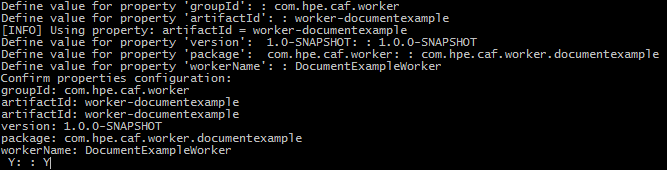

# Creating a Document Worker

## Prerequisites

- Maven
- Docker VM
- IntelliJ (Optional)
- NetBeans (Optional)

## Introduction

Stateless Workers are microservices that can be scaled up or down to meet demand. In essence, a Worker should not be aware
(or need to be aware) of any other Worker or its surrounding system. This way additional "clones" of a Worker can be created or destroyed
at will to provide scaling without affecting other Workers.

### Components of a Document Worker

The following modules are required to create a Document worker. Each contains its own pom.xml with its own dependencies and plugins:

**These modules are generated from the worker-document-archetype:**
- `worker-example` module contains the worker itself and an md documentation explaining the service use of the worker.
	1. **ExampleWorker** – responsible for doing the work. By default this class implements the BulkDocumentWorker interface. It should be updated to implement the DocumentWorker interface instead if there is no requirement to process documents in batches.
- `worker-example-container` module is for building the Docker image of the worker and pushing the image to Docker. The module starts a container for RabbitMQ, the worker, and runs the worker acceptance integration testcases via the `worker-document-testing` module.
	1. **ExampleWorkerAcceptanceIT** – calls the `worker-document-testing` module's DocumentWorkerTestControllerProvider class to generate or run worker integration testing testcase files.
	2. **pom.xml** – specifies the Docker Maven plugin configurations to build the image for the worker, and Maven compiler and failsafe plugin for compiling and running integration tests.

## Using the Document Worker Archetype

A Maven Archetype is a template which you can base a project on.

Excerpt from [Apache Maven Archetype Introduction](https://maven.apache.org/guides/introduction/introduction-to-archetypes.html) :

<pre>"Archetype is a Maven project templating toolkit.
An archetype is defined as an original pattern or model from which all other things of the same kind are made."</pre>

### Maven Archetype for Document Worker projects

You can create the foundations of a new Document Worker project by using the `worker-document-archetype` project.

The generation of a new project from the Document Worker Archetype will contain some basic functionality.

It performs a simple lookup on values from the fields passed in from a Document. It looks for a field name of 'REFERENCE', uses its values
to retrieve values from a Map, and replace any existing values in the 'UNIQUE_ID' field, with the retrieved values.

### Creating a new Document Worker from Document Worker Archetype

A new Document Worker aggregator project generated from the Document Worker Archetype has a set of properties that are shared between its submodules:

- ArtifactID
- GroupID
- Version
- Package
- WorkerName

The following subsections provide instructions on how you can use Maven Command Line Interface (CLI), IntelliJ Integrated Development
Environment (IDE) or NetBeans IDE to create the components of a Document Worker from the Document Worker Archetype.
*Note: You must replace __WORKER-DOCUMENT-ARCHETYPE-VERSION__ with a valid version of Worker-Document-Archetype.*

#### Maven CLI

The Maven CLI offers developers the ability to generate projects from archetypes with the `mvn archetype:generate` command. The location
where you run the command will be where the project is created.

##### Generate the New Document Worker Aggregator

Generate the new Document Worker Aggregator from the `worker-document-archetype` with the following Maven command:

<pre>mvn archetype:generate -DarchetypeVersion=WORKER-DOCUMENT-ARCHETYPE-VERSION -DarchetypeArtifactId=worker-document-archetype -DarchetypeGroupId=com.github.cafdataprocessing</pre>

The CLI will prompt you for artifactId, groupId, version (default suggestion is 1.0.0), package (default suggestion is the
groupId, you should however adjust this to include the worker's purpose) and workerName properties required for the new Document Worker
project. See Figure 1.

*Figure 1*

If you are satisfied with the properties you have set, confirm these by typing 'Y' else if you are not satisfied type 'N' or any other
character to re-enter property values. After confirming your properties Maven will generate the new Document Worker Aggregator project
which will contain the following submodules:

- `<artifactId>` - submodule containing the Worker's backend code.
- `<artifactId>-container` - submodule containing the Worker's container and configuration.

#### IntelliJ IDE

IntelliJ offers developers the ability to generate projects from archetypes via its GUI.

##### Generate the New Document Worker Aggregator

Generate the new Document Worker Aggregator from the `worker-document-archetype` by following these instructions:

- 'File > New > Project...'
- Select Maven from the left-hand pane > Tick 'Create from archetype' > Click 'Add Archetype...'
- Specify the details of the 'worker-document-archetype'
	- GroupId : com.github.cafdataprocessing
	- ArtifactId : worker-document-archetype
	- Version : *WORKER-DOCUMENT-ARCHETYPE-VERSION*
	- Click 'OK'
- Select the added 'com.hpe.caf.worker:worker-document-archetype' archetype > Click 'Next'
- Enter GroupId, ArtifactId and Version of your Worker project > Click 'Next', e.g:
	- GroupId : com.github.cafdataprocessing
	- ArtifactId : worker-documentexample
	- Version : 1.0.0
- Add each of the following properties (Alt+Insert) and replace the example values with your project specific values > Click 'Next':
	- package : com.hpe.caf.worker.documentexample
	- workerName : DocumentExampleWorker
- Name the Project after its ArtifactId and specify the location of the project > Click 'Finish', e.g:
	- Project name : worker-documentexample
	- Project location : C:\MyWorkerProjects\worker-documentexample

The foundations for your new Document Worker is now set up. The generated project will contain the following submodules:

- `<artifactId>` - submodule containing the Worker's backend code.
- `<artifactId>-container` - submodule containing the Worker's container and configuration.

#### NetBeans IDE

NetBeans offers developers the ability to generate projects from archetypes via its GUI.

##### Generate the New Document Worker Aggregator

Generate the new Document Worker Aggregator from the `worker-document-archetype` by following these instructions:

- 'File > New Project...'
- From the Categories Pane select Maven > From the Select Pane select 'Project from Archetype' > Click 'Next >'
- Specify the details of the 'worker-document-archetype'
	- GroupId : com.github.cafdataprocessing
	- ArtifactId : worker-document-archetype
	- Version : *WORKER-DOCUMENT-ARCHETYPE-VERSION*
	- Click 'Next >'
- Enter Project Name, Project Location, GroupId, Version and Package of your Worker Shared project, e.g:
	- Project Name : worker-documentexample
	- Project Location : C:\MyWorkerProjects
	- GroupId : com.github.cafdataprocessing
	- Version : 1.0.0
	- Package : com.hpe.caf.worker.documentexample
- Set workerName property > Click 'Finish', e.g:
	- workerName : DocumentExampleWorker

The foundations for your new Document Worker is now set up. The generated project will contain the following submodules:

- `<artifactId>` - submodule containing the Worker's backend code.
- `<artifactId>-container` - submodule containing the Worker's container and configuration.

## Document Worker Default Configuration

The `<artifactId>-container` submodule contains a default JavaScript configuration file.
Configuration variables check an environment variable for a value. If no value is found for an environment variable a default value is set if applicable.

### DocumentWorkerConfiguration

The default Document Worker configuration file checks for values as below;

| Property | Checked Environment Variables | Default               |
|----------|-------------------------------|-----------------------|
| outputQueue  |  `CAF_WORKER_OUTPUT_QUEUE` | Use environment variable `CAF_WORKER_BASE_QUEUE_NAME` + "-out".   Or use environment variable `CAF_WORKER_NAME` + "-out".   Else use "worker-out".  |
| failureQueue | `CAF_WORKER_FAILURE_QUEUE` | undefined  |
| threads  |  `CAF_WORKER_THREADS` | 1  |
| maxBatchSize  |  `CAF_WORKER_MAX_BATCH_SIZE` | 2  |
| maxBatchTime  |  `CAF_WORKER_MAX_BATCH_TIME` | 5000  |

## Further Information

Information on worker-document and its modules worker-document-shared, and worker-document-testing, which the archetype utilizes can be
found [here](https://github.com/CAFDataProcessing/worker-document/blob/develop/README.md).

At the time this guide was written with:

- Apache Maven 3.3.3
- NetBeans 8.1
- IntelliJ 15