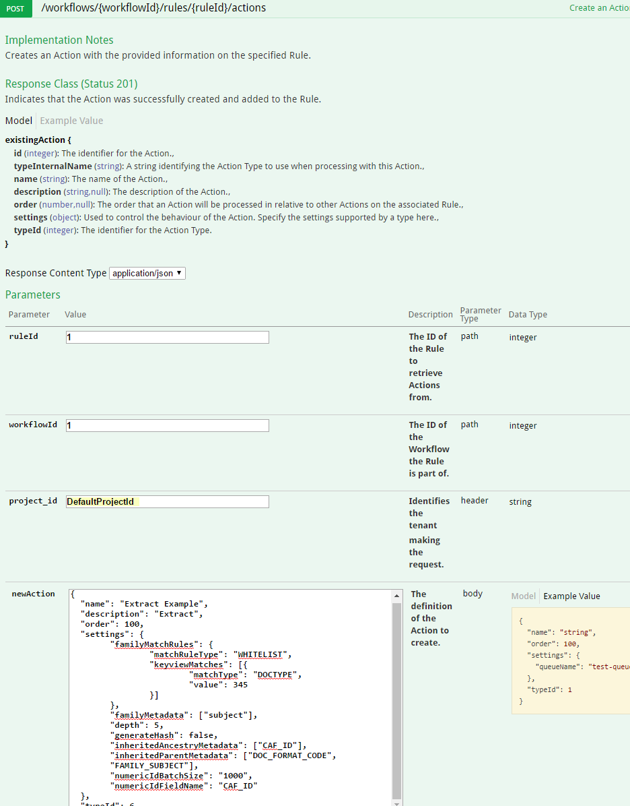
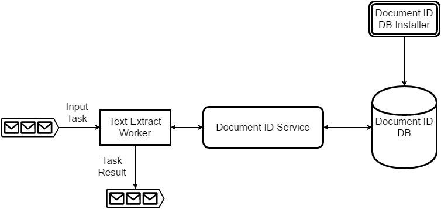

# Text Extract

The text extract action offers the ability to extract the metadata, content and sub-files of a document recursively.

## Contents

+ [Overview](#overview)
+ [Getting Started](#getting-started)
+ [Architecture](#architecture)
+ [Action Settings](#action-settings)
+ [Additional Documentation](#additional-documentation)

## Overview

Text extract in Data Processing uses the text extract worker to extract the following from a document:

+ Sub-files contained within the document with support for inheriting the properties of parent documents.
+ Generic metadata that describes the document, for example, MIME Type, document title, and file size.
+ Properties specific to the file type, such as the send date, and to and from fields for emails.
+ The content of text-based documents.

Text extract can also generate an MD5 hash for a file and assign unique identifiers to documents through the use of the document ID service.

The text extract action can be used multiple times in a workflow to invoke different extraction features conditionally, for example, an initial action to expand sub-files against all documents, then an action to extract metadata from sub-files of a particular type.

The Text Extract processing operation is only available with the Enterprise Edition of Data Processing, for details on obtaining an Enterprise Edition license please raise an issue [here](https://github.com/CAFDataProcessing/data-processing-service/issues):

## Getting Started

### Deployment

The components required for text extract are included as part of the Enterprise Edition data processing service compose file available [here](https://github.hpe.com/caf/data-processing-service-internal-deploy). Refer to Data Processing Getting Started [here](../Getting-Started) for deploy instructions. If not using the compose file, you will need to deploy the workflow worker (with text extract handler and converter on its classpath), workflow database and extract worker for this action.

### Creating Text Extract Actions

The text extract action will be added to a rule that is part of a workflow. Refer to the **Create a Workflow** and **Create a Rule** sections of Getting Started for Data Processing [here](../Getting-Started) to create these for the action to be added to and the **Retrieve Action Types** section to identify the id of the text extract action type.


#### Extract sub-files

Here we create an action that uses some of the available settings on the text extract action to perform extract operations on a document. The settings for the action should be as below;

```
{
	"familyMatchRules": {
		"matchRuleType": "WHITELIST",
		"keyviewMatches": [{
			"matchType": "DOCTYPE",
			"value": 345
		}]
	},
	"familyMetadata": ["subject"],
	"depth": 5,
	"generateHash": false,
	"inheritedParentMetadata": ["DOC_FORMAT_CODE", "FAMILY_SUBJECT"]
}
```

This definition states:

+ A document is considered a family document if it is an email, and family documents should record their subject in a family field. See [Additional Documentation](#additional-documentation) for code reference.
+ Recursively extract all sub-files, to a depth of five files.
+ Do not generate a hash code for each document.
+ Sub-files should record their parents DOC_FORMAT_CODE and FAMILY_SUBJECT fields.

To test the text extract action and creation of an ID:

1. Under Actions, expand the POST operation /workflows/{workflowId}/rules/{ruleId}/action.
2. Set project_id, workflowId and ruleId to those previously used and created.
3. Click on the example value box on the right to fill in the new action body.
4. Click on Model for an explanation of each property.
5. Delete the queueName property (allowing the default value for the deployed system).
6. Set the value of the settings property to be the JSON definition above.
7. Set the name of the action to Extract Example and the typeId to the ID of the text extract action type. This will be the action type with internal name set to TextExtractWorkerHandler. Add a description property with the value Perform Keyview extraction against document.
8. Click Try it out. The call will return code 201 for successful creation along with the successfully created action and an ID.

    
    
#### Create an Output Action

To output the built-up result from the text extract action, use the Generic Queue action, which can send the document with all of its added fields to any specified queue.

1. Under Actions, expand the POST operation /workflows/{workflowId}/rules/{ruleId}/action.
2. Set project_id, workflowId to the values from previous calls. Set ruleId to the ID of the second rule created.
3. Click on the example value box on the right to fill in the new action body.
4. Set the name of the action to output action and the typeId to the ID of the Generic Queue action type. Change the queueName settings value to a queue from which output will be retrieved, for example, output-queue. The queue is created if it does not already exist. Add a description property with the value Send processed documents to specified queue.
5. Click Try it out. The call will return code 201 for successful creation with the successfully created action and an ID.

    

#### Example Output

With the workflow created, an example file passed in is processed according to the settings on the action. To illustrate the effect of these settings, we can look at a sample file that is structured as below (the number beside each file indicating its depth, for example, 0 is the root file passed in);

0. An email
1. The email has an attached archive.
2. The archive contains another email.
3. That second email has an archive attached.
4. The second attached archive contains a document.

##### Notable fields output for email, '0'.

```
{
  "DOC_FORMAT_CODE": "345",
  "subject": "Test email",
  "FAMILY_subject": "Test email"

}
```

Here we see that fields that will be inherited to sub-files have been added and, as it meets the criteria for a family document, the subject field has been recorded in a family-specific field for inheritance.

##### Notable fields output for archive attached to email, '1'.

```
{
  "PARENT_DOC_FORMAT_CODE": "345",
  "PARENT_FAMILY_subject": "Test email",
  "DOC_FORMAT_CODE": "157",
  "ROOT_FAMILY_subject": "Test email"
}
```

The archive has its document type extracted, which will be inherited by its direct child. The doc type, subject and ID of its parent are inherited as fields.

##### Notable fields output for email inside archive, '2',

```
{
  "PARENT_DOC_FORMAT_CODE": "157",
  "DOC_FORMAT_CODE": "345",
  "FAMILY_subject": "Attached zip with a doc that has an image in it",
  "ROOT_FAMILY_subject": "Test email",
  "subject": "Attached zip with a doc that has an image in it"
}
```

As before, we see the document type field and also that the subject has been extracted. It has inherited its parent's document type as a field. As this matches the criteria for a family document, it records a new FAMILY_subject field while also inheriting the original family document's subject as ROOT_FAMILY_subject.

###### Notable fields output for archive inside second email, '3'. 

```
{
  "PARENT_FAMILY_subject": "Attached zip with a doc that has an image in it",
  "PARENT_DOC_FORMAT_CODE": "345",
  "DOC_FORMAT_CODE": "157",
  "ROOT_FAMILY_subject": "Test email"
}
```

This archive has inherited the document type and family field of its parent along with the original root family field.

###### Notable fields output for document inside second archive, '4'.

```
{
  "DOC_FORMAT_CODE": "360",
  "PARENT_DOC_FORMAT_CODE": "157",
  "ROOT_FAMILY_subject": "Test email"
}
```

Finally, the last sub-file has has inherited the appropriate fields.

#### Summary

The text extract action extracted sub-files up to five levels deep and passed down specified pieces of metadata based on the settings provided. The inheritance options provide various ways to link files together and propagate relevant information.

The action provides additional settings to achieve other desired effects, which are detailed in the [Action Settings](#action-settings) section.

## Architecture

The figure below illustrates a high-level view of the components that make up text extract.



When the workflow worker encounters a text extract action, it invokes these text extract components. The text extract handler constructs and sends a task to the extract worker input queue. The worker processes the task and outputs the result to the workflow worker's input queue. The resulting messsage is examined. If the message is determined to have come from the extract worker, the text extract converter reconstructs the workflow task, adding the results from text extract onto the document on the task. From there, the workflow worker continues with the task, evaluating the document (with its new fields added) against the next action.

### Text Extract Worker

The text extract worker provides metadata, sub-file, content extraction and ID assignment to documents. 

The worker uses a local Keyview instance to extract metadata from files and sub-files contained within them. It uses the native Linux x86-64 Keyview binaries and the Keyview Java API. 

Tasks sent to the worker can also specify that ID's should be assigned to the documents processed, including any extracted sub-files. This assignment is done by the task providing the field to add the ID under, the range of IDs to retrieve and the URL of the document ID service that should be called to retrieve the IDs.

### Fields Added To Document

When the result from the extract worker is processed by the text extract converter, fields are added to the document reflecting the result.

| Field Name | Description |
| ---------- | ----------- |
| CONTENT  | The text extracted from the document. |
| FILTER_STATUS | The status of the text extract worker's filter operation. |
| EXTRACT_STATUS | The status of the text extract operation. |
| DOC_CLASS_CODE | The document class code, representing a classification group of files, such as audio or video. |
| DOC_FORMAT_CODE | The document format code, representing that actual file format of the document. |
| EXTRACT_HASH | The raw bytes of the computed hash returned from the text extract worker. |
| KV_CODE | The result of the text extract worker's internal Keyview library when filtering. |
| SUBFILE_STATUS | The result status of any operations performed on the document's sub-documents. |
| SUBFILE_COUNT | The number of sub-documents extracted from this document. |
| MIME_TYPE | The Multipurpose Internet Mail Extensions (MIME) type of content of the document. Only returned from extract worker 3.6+. |

The EXTRACT_STATUS & FILTER_STATUS fields can have the following possible values;

| Value | Description 
| ---------- | ----------- |
| NOT_PERFORMED | The filter operation was not performed. |
| COMPLETED | The filter operation completed without failure. |
| FAILED | The filer operation did not complete. |

The KV_CODE field can have the following possible values:

| Value | Description 
| ---------- | ----------- |
| KVERR_Success | Keyview successfully completed. |
| KVERR_General | A general Keyview error. |
| KVERR_FormatNotSupported | The file format was not supported by Keyview. |
| KVERR_PasswordProtected | The document was encrypted or password protected. |

The SUBFILE_STATUS field can have the following possible values:

| Value | Description 
| ---------- | ----------- |
| COMPLETED | The sub-document operation completed successfully or no sub-documents were present. |
| SOURCE_FAILURE | The worker failed to retrieve the sub-document from storage. |
| SOURCE_NOT_FOUND | The sub-document was not in storage. |
| STREAM_FAILURE | The worker failed to internally read the sub-document. |
| KEYVIEW_FAILURE | The internal Keyview library failed to perform the operation on the sub-document. |

The converter also adds all metadata returned from the text extract worker to the document, including FAMILY, ANCESTRY and ROOT inherited fields.

All fields added by this converter are recorded on the data processing record of the document. An exception is made for sub-documents on their first entry into the workflow after extraction by the text extract worker. Their original state is considered the point after they have gone through the converter.

## Action Settings

The text extract action type allows for a large number of settings to be provided on a created action. The following is a list of the available settings.

<table>
    <tr>
        <td><b>Name</b></td>
        <td><b>Type</b></td>
        <td><b>Description</b></td>
    </tr>
    <tr>
        <td>depth</td>
        <td>Integer</td>
        <td>Specifies the maximum depth to which to expand nested containers. When not specified, -1 is assumed, indicating expand all.</td>
    </tr>
    <tr>
        <td>extractedMetadata</td>
        <td>Boolean</td>
        <td>Indicates whether metadata should be extracted. Possible values are true and false. When not specified, true is assumed.</td>
    </tr>
    <tr>
        <td>generateHash</td>
        <td>Boolean</td>
        <td>Indicates whether an MD5 should be generated for each individual document. Possible values are true and false. When not specified, true is assumed.</td>
    </tr>
    <tr>
        <td>normalizeFamilyMetadata</td>
        <td>Boolean</td>
        <td>Specifies whether a normalized set of family metadata should be generated. When set to true, it ensures that the metadata of the root file and each subfile includes a value with the name prefix "NORMALIZED_" for each family metadata field configured in familyMetadata. If a file has a value of ROOT_FAMILY_xyz for some familyMetadata field xyz, then that file's NORMALIZED_xyz value will be the same as its ROOT_FAMILY_xyz value. If the file has no value of ROOT_FAMILY_xyz, then the file's NORMALIZED_xyz value will be the file's xyz value. This parameter defaults to false.</td>
    </tr>
    <tr>
        <td>queueName</td>
        <td>String</td>
        <td>Optional. A Text Extract Policy Handler exists to execute policies of type Text Extract Policy Type.  Typically, the target queue name is provided via Text Extract Policy Handler configuration.  If there is a need to establish multiple instances of a Text Extract Policy to target different queues, then queueName should be specified as part of the Text Extract Policy. An example usage of this feature could be to route larger files to a different queue.</td>
    </tr>
    <tr>
        <td>diagnosticsQueueName</td>
        <td>String</td>
        <td>Optional. An example usage of this feature could be to route failed files to a different text extract queue for diagnostics.</td>
    </tr>
    <tr>
        <td>numericIdBatchSize</td>
        <td>String</td>
        <td>Optional. Indicates the batch size to be used when providing unique identifiers for extracted documents.</td>
    </tr>
    <tr>
        <td>numericIdFieldName</td>
        <td>String</td>
        <td>Optional. Identifies the generated unique Id in a file's metadata.</td>
    </tr>
    <tr>
        <td>storeMatchRules</td>
        <td>KeyviewMatchRules</td>
        <td>Optional. Indicates the types of files that should be stored permanently after they have been extracted from a container file. When not specified, all files will be stored. Refer to help documentation for WHITELIST and BLACKLIST examples.</td>
    </tr>
    <tr>
        <td>filterMatchRules</td>
        <td>KeyviewMatchRules</td>
        <td>Optional. Indicates the types of files from which metadata should be extracted.  When not specified, all files will be submitted for metadata extraction. Refer to the help documentation for WHITELIST and BLACKLIST examples.</td>
    </tr>
    <tr>
        <td>inheritMatchRules</td>
        <td>KeyviewMatchRules</td>
        <td>Optional.  Indicates the types of container and compound documents that should push theirmeta data to their sub-documents.  When not specified, all container and compound documents push meta data to their sub-documents.  Refer to help documentation for WHITELIST and BLACKLIST examples.  Refer also to inheritedRootMetadata and inheritedParentMetadata.</td>
    </tr>
    <tr>
        <td>familyMatchRules</td>
        <td>KeyviewMatchRules</td>
        <td>Optional. Indicates the types of container and compound documents that should copy their metadata with the FAMILY_ prefix.  When not specified, all container and compound documents are considered to be family documents. Refer to the help documentation for WHITELIST and BLACKLIST examples. Refer also to familyMetadata.</td>
    </tr>
    <tr>
        <td>ancestryMatchRules</td>
        <td>KeyviewMatchRules</td>
        <td>Optional.  Indicates the types of container and compound documents that should push their ancestry field to their sub-documents.  When not specified all container and compound documents are considered to be ancestry documents.  If ancestryMatchRules is null, no file will have an ancestry field.  Refer to the help documentation for WHITELIST and BLACKLIST examples. Refer also to inheritedAncestryMetadata.</td>
    </tr>
    <tr>
        <td>inheritedRootMetadata</td>
        <td>Set&lt;String&gt;</td>
        <td>Optional. Identifies the metadata to be inherited from root documents to their child documents.</td>
    </tr>
    <tr>
        <td>inheritedParentMetadata</td>
        <td>Set&lt;String&gt;</td>
        <td>Optional. Identifies the metadata to inherit from parent documents to their child documents.</td>
    </tr>
    <tr>
        <td>inheritedAncestryMetadata</td>
        <td>Set&lt;String&gt;</td>
        <td>Optional. Identifies the metadata to inherit from ancestor documents to their child documents.</td>
    </tr>
    <tr>
        <td>familyMetadata</td>
        <td>Set&lt;String&gt;</td>
        <td>"Optional. Identifies the metadata to copy with the FAMILY_ prefix for family documents.</td>
    </tr>
    <tr>
        <td>additionalRootMetadata</td>
        <td>Map&lt;String,Set&lt;String&gt;&gt;</td>
        <td>Optional. Identifies additional metadata to add to root documents.</td>
    </tr>
    <tr>
        <td>additionalDocumentMetadata</td>
        <td>Set&lt;String&gt;</td>
        <td>Optional. Identifies additional metadata to obtain from each source document and add to the root document. The metadata may be inherited along with other root or parent metadata. Refer also to inheritedRootMetadata and inheritedParentMetadata.</td>
    </tr>
</table>

The type KeyviewMatchRules is defined as below.

### KeyviewMatchRules

<table>
    <tr>
        <td><b>Name</b></td>
        <td><b>Type</b></td>
        <td><b>Description</b></td>
    </tr>
    <tr>
        <td>matchRuleType</td>
        <td>Enum</td>
        <td>Specifies whether the rules are white or black list. Values are WHITELIST or BLACKLIST.</td>
    </tr>
    <tr>
        <td>keyviewMatches</td>
        <td>List&lt;KeyviewMatch&gt;</td>
        <td>List of individual Keyview match rule.s</td>
    </tr>
</table>

The type KeyviewMatch is defined as below.

### KeyviewMatch

<table>
    <tr>
        <td><b>Name</b></td>
        <td><b>Type</b></td>
        <td><b>Description</b></td>
    </tr>
    <tr>
        <td>matchType</td>
        <td>Enum</td>
        <td>Specifies the type of match rule, either DOCCLASS or DOCTYPE.</td>
    </tr>
    <tr>
        <td>value</td>
        <td>Integer</td>
        <td>The value of the rule. This is either a DOCCLASS or DOCTYPE code.</td>
    </tr>    
</table>

### Example Action Settings

The following setting examples demonstrate how to vary the behaviour of the text extract action. When creating or updating the action, the settings property would be set to these JSON values.

##### Extract Files

To extract files 1 level deep only:

```
{
  "depth": 1
}
```

#### Exclude ISO files

To exclude filtering of .iso files:

```
{
  "filterMatchRules": {
    "matchRuleType": "BLACKLIST",
    "keyviewMatches": [
      { "matchType": "DOCTYPE", "value": 414 }
    ]
  }
}
```

#### Sending to another queue

As with other action, the text extract action supports controlling the queue that the processing task is sent to as a setting on the action.

```
{
  "queueName" : "MyExampleQueue"
}
```

### Example Document Metadata

```
{
  "DOC_FORMAT_CODE": ["360"],
  "DOC_CLASS_CODE": ["1"],
  "EXTRACT_HASH": "6fdde53b635c7d2cc56eca022682858d",
  "MIME_TYPE": ["application/msword"],
  "pagecount": ["1"],
  "TITLE": ["Test Document.docx"]
}
```

The content of text documents is extracted to a metadata reference field that refers to a location in CAF storage, where the content is stored.

```
{
  "CONTENT": {
    "reference": "c82335049236404ba86529e9afacba39/f47eb2ca253b4908a77f58eab37dea7a",
    "data": ""
  }
}
```

## Additional Documentation

A list of the supported file formats for the text extract action can be found [here](copied/Supported_File_Formats).

A reference for the document class and format codes output by the text extract worker can be found [here](copied/Document_Class_and_Format_Code).